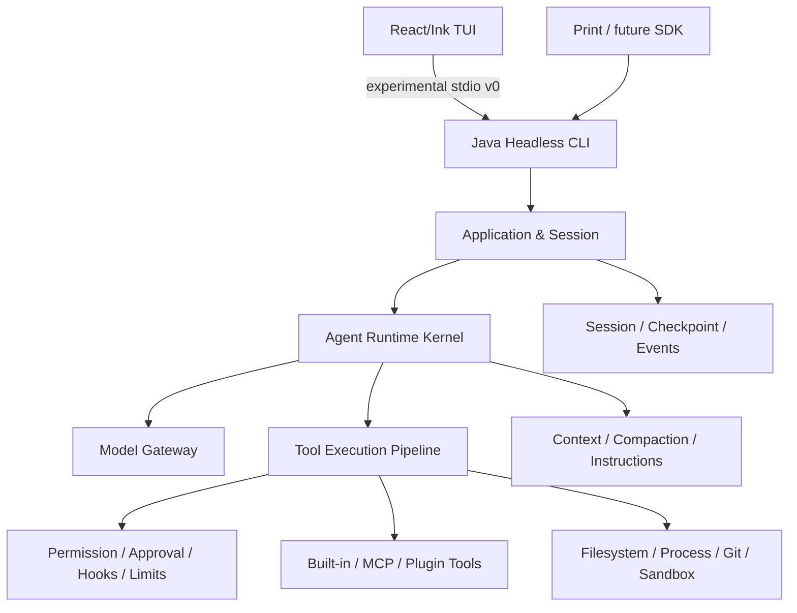

# cc-java

一个以成熟 Coding Agent 为参照、用 Java 独立重实现的学习型 Agent Runtime 与 CLI。

> 当前状态：**S01 Runtime Kernel 与 S02 Model + Streaming CLI 均已 Accepted**。框架无关领域协议、
> 显式 Agent Loop、Tool Pipeline 和内存 Session 已通过 Commit-scoped 离线验证；
> S02 已重新固定为 24 项范围，并选定“Java Headless Runtime + 实验性 stdio v0 +
> React/Ink TUI”；真实 OpenAI-compatible Provider、文本流、原始 Tool Call、
> Core 取消、连续 Headless Session、TUI 非 TTY、Picocli Java `--print`、
> CLI Override、墙钟超时和隐私安全的 Run/Turn/Tool Telemetry 链路已跑通。
> 跨 Chunk 多 Tool、429 有界重试、不完整流与长度终态已有本机 OpenAI-compatible
> Contract 证据；真实中转模型同回合只返回一个 Tool Call，该限制已登记为明确偏差。
> S02 已在实现 Commit `700251e` 上通过 G0-G6。S03 已按
> [ADR-032](./docs/adr/ADR-032-s03-read-tools-security-contract.md)实现五个只读 Tool、
> WorkspaceGuard、结果硬上限、根 `AGENTS.md` 与安全 Tool 进度，并通过离线 E2E、真实
> Windows Junction 和实现 Commit `71a2818` 的 Commit-scoped 复验；S03 Stage Exit 已 Accepted。
> 后续搜索机制校正依据授权快照提炼的 ripgrep 策略：受控 rg 已支持完整 Grep 参数、
> content/files/count、JSON 结果、分页、取消、超时和一次资源恢复；Java 字面扫描只作为
> rg 缺失时的受限降级，精确代码搜索不使用 RAG。
> PowerShell 启动器会从 `CC_JAVA_RIPGREP_PATH`、PATH 或本机现有 Codex Desktop
> 安装中解析 rg；项目本身不下载或分发该二进制。
> TUI 已将连续只读 Tool 聚合为安全活动摘要，搜索按 content/files/count 显示匹配或
> 文件条目数，并使用 Markdown Ink 组件区分标题、列表、代码与终态；Java Runtime
> 仍是 Run 状态的唯一权威。
>
> S04 已完成 Approval、真实 Patch/Write、Command 与公开 Fixture Coding
> Loop：固定 DEFAULT/PLAN Effect 决策表、
> 可取消的 Allow Once / Deny stdio 协议、React/Ink 审批面板、精确上下文
> `apply_patch` 和只创建新文件的 `write_file` 已接入生产 Tool Registry。写入审批只展示
> 相对路径、创建/修改和行数；文件 Tool 已覆盖内容冲突、父目录 realpath、敏感路径、
> Junction/Symlink、同目录暂存、取消和结果上限。`run_command` 已实现固定
> Shell/Workspace、准确命令审批、最小环境、stdout/stderr 事件、输出上限、
> timeout/cancel 和 Windows 进程树清理。PRD 的 `Calculator.divide` 公开 Fixture 已
> 真实经历越权拒绝、测试失败、再次 Patch、测试成功和 Git Diff；`EVAL-01` 达到单
> Seed Task 的 L1。实现 Commit `16b4767` 已通过 Commit-scoped G0-G6，S04 Stage
> Exit 为 Accepted。
>
> S05 Permission Pipeline 已在实现 Commit
> `f7b7137081e2d85417fa5965835d4c014e514dac` 上完成 Commit-scoped G0-G6，Stage Exit 为
> Accepted。生产装配支持 `DEFAULT/PLAN/ACCEPT_EDITS`、固定优先级的
> `ALLOW/ASK/DENY`、绑定可信 ToolSource 与 selector 的 Session Grant、Protected
> Paths/Hard Denial、隐私安全且唯一 final 的 Permission Lifecycle、Print Fail Closed、拒绝
> 防循环，以及 Fake MCP/Plugin/Sub-Agent 的统一 Pipeline/64K 输出上限；所列 Capability
> 已按 ADR-039 的退出目标达到 L2。
>
> S06 Session + Checkpoint 已在实现 Commit
> `0a9df85b4a2d8532826c63aa96889540369cd1e9` 上完成 Commit-scoped G0-G6，Stage Exit 为
> Accepted。生产路径现已提供项目自有 append-only semantic JSONL、Create/Continue/Resume/Fork/Inspect、
> Workspace-aware metadata、本机单 Writer、未完成 Tool Recovery Gate、写前 ordinary-file
> Checkpoint、有界 Diff 与逐项显式 Undo；Java CLI/Print/stdio/TUI 共用同一 Runtime，Behavior Replay
> 已验证 Resume/Fork canonical history。任何有副作用操作都绝不自动重放；`SESSION-08` 仍仅为 L1；
> S07 Context Engineering 已在 Commit-scoped G0-G6 对账后 Accepted：生产路径提供短生命周期 Context Projection、条件式 C1-C4、typed overflow 至多一次恢复、内部 Usage View、M1-M5 文件记忆及 ready-only 零等待预取；离线长会话 Eval 保持 Canonical/Tool 协议、事实/硬约束与完成率，并取得 49% 的估算 Token 降幅中位数。S08 已在 corrective implementation Commit `8fabd94b66881a4a8236cccabd4ae61dd39845d4` 上完成 ADR-048 G0-G6；ADR-049 的 Workspace-safe `@file` 候选、提交时快照、Session Resume/Fork、模型附件投影与 TUI token 补全又在实现 Commit `5910a8f` 上完成 Commit-scoped G0-G6，`CLI-13`/`CTX-19` 达到 L2，S08 保持 Accepted。S09 现已完成严格 user/project Settings、精确指纹 Trust、Command/loopback HTTP、生命周期、Compact 与 transient Context Projection，G0-G6 Accepted。S10 新增隔离的 `cc-java-mcp` Adapter，STDIO/Streamable HTTP、多 Server、filter/prefix、统一 Permission/Approval/Pipeline、Trust 与单次断线恢复均通过真实 Transport 和 Headless E2E，Tool 主链 G0-G6 Accepted；S11 Skills + Plugins 已在实现 Commit `71278431dd1e5c7c4e279b44f43e084755502a5d` 上完成 Commit-scoped G0-G6，Stage Exit Accepted；`SKILL-01..07`、`CTX-14`、`PLUGIN-01..03` 为 L2，`PLUGIN-04` 为 L1。Maven 813 tests/21 skips、Demo 67/67、TUI 129/129、launcher 59/59 与 Dashboard 均通过。S12 已在实现 Commit `cfbe0282b37a93e38256c3d2d6f22ed2207975a5` 上完成 Commit-scoped G0-G6 与 Stage Exit；标准 clean verify 838 tests/21 skips、TUI 133/133、launcher 59 assertions 与 Dashboard 均通过。`SUB-01..05/07..10`、`CTX-15`、`HOOK-08`、`TOOL-15` 为 L2，`SUB-06/HOOK-11` 为 L1；Worktree reparse、Git fault/timeout 与 Windows remove/branch-lock cancellation recovery 仍是明确 gap。S13 已在实现 Commit `8a75d5f5e977ce4c5fcd19fafb3e5776a5ec2bf3` 上完成 Commit-scoped G0-G6 与 Stage Exit，状态为 Accepted：框架无关 `ExecutionBackend`/五维 policy、明确 UNSANDBOXED Local、WSL2 Ubuntu+bwrap 0.4.0 Linux A、Docker daemon+pinned-image B、native Windows process/env B（file/network U）、显式 LINUX_SH/后端 CLI、真实攻击回归、Command Hook/MCP stdio managed seam 与 root/child execution composition 均已验证。标准 clean verify 为 851 tests/29 skips，TUI 133/133、launcher 59 assertions，真实 selector 5/5 + attack 8/8 共 13/13；首次真实测试因 Docker daemon 未运行导致 5 个 Docker 用例失败，启动 Docker Desktop（daemon 26.1.4）后完整通过，测试后 `cc-java.s13=true` residue 为 0。`SEC-02/03/04/05/06/07/12` 与 `EVAL-04` 为 L2，`SEC-08` 为 L1；S14 后 `CFG-07` 为 L1，`PERM-05/SEC-11` 保持 L0、`HOOK-10` 保持 L1。Permission、Checkpoint、Worktree、Job cleanup、最小环境和 Local backend 不得描述为 OS Sandbox；JVM 内 HTTP、Marketplace、完整签名身份、Lazy Tool、Resource/Prompt 自动投影与 OAuth 仍明确未实现。S14 已在实现 Commit `dff814c1bb5a659979e007061e6d10a0a9ff6e82` 上完成 Provider/Eval/OTel、stable v1/SDK/Daemon/Session Lifecycle、Managed/Plugin Recovery/Distribution 三个 Batch的 Commit-scoped G0-G6，Stage Exit Accepted with documented deviations。真实 Anthropic、双 Provider 重复、WSL JDK21、macOS/Native Image 与已发布 N-1 artifact 尚无证据，相关 L3 不宣称；License 未决只生成本地/CI artifact，不公开 Release。

## 项目目标

这个项目不是先做一个功能有限的聊天 CLI，再凭感觉决定加什么；也不是逐行翻译某份受限制源码。它采用一条可持续验证的学习路径：

```text
登记公开行为范围与来源/权利边界
→ 区分 Documented、Observed、Inferred 与 Unknown
→ 拆解成熟系统的职责、状态和失败路径
→ 用 Java 独立重实现 Runtime，并为终端选择成熟 UI 技术
→ 用场景、测试和指标对照差距
→ 补齐参考能力
→ 在理解之后形成自己的创新
```

长期目标是理解并实现完整的 Coding Agent Harness：Agent Loop、模型适配、工具执行、权限、会话、上下文、配置、Hooks、MCP、Skills、Subagent、Sandbox、可观测性与评测。

FixBug、代码评审和测试生成会成为上层 Skill 或示例场景，不会定义 Runtime Core。

## 如何知道与成熟项目的差距

[功能对照矩阵](./docs/feature-parity-matrix.md)是项目进度的权威账本。每一项参考能力都有稳定 ID，并按以下等级记录：

[项目进度看板](./docs/progress.html)把矩阵、当前 Stage Gate、阻塞项和最近验证生成为
可搜索的单页 HTML，适合日常查看。HTML 是派生展示，发生冲突时仍以功能矩阵和
Stage 证据为准。

| 等级 | 含义 |
| --- | --- |
| L0 | 尚未开始 |
| L1 | 已理解协议并完成学习骨架 |
| L2 | 可在真实任务中使用 |
| L3 | 关键行为和异常路径可与参考基线比较 |
| L4 | 在评测数据支持下形成 Java 生态差异化 |

R2026.03 基线目前追踪 197 个 Capability ID。S01-S14 已完成 Accepted Stage Exit；当前
150 项为 L2、37 项为 L1、10 项为 L0。S13 只确认 Linux A、Container B、native Windows
process/env B（file/network U）及其对应 L2/L1 能力；这不表示已有全平台同等级 OS Sandbox。
S14 已在实现 Commit `dff814c1bb5a659979e007061e6d10a0a9ff6e82` 上完成 Commit-scoped
G0-G6 与 Stage Exit（Accepted with documented deviations）：12 seed×5 的 60 个真实
production-harness 场景、Session canonical control、Plugin transaction/registry migration、
production OTel、stable v1/SDK/Daemon、Provider Router、Managed enforcement 与本地发行/rollback
均有固定证据。无真实 Anthropic 在线证据、无已发布 N-1 升级证明、WSL 无 JDK21，以及缺少
macOS/Native Image/公开更新服务仍为明确 deviation；`CFG-07`、`SESSION-14` 等继续保持矩阵中的
较低等级，不据 Stage Exit 偷升为 L2/L3。
默认最终目标为 L3，任何不实现项都必须记录 `Accepted Deviation`。

项目同时度量四件事：

1. **Capability Coverage**：参考能力覆盖了多少；
2. **Behavioral Conformance**：同类任务中的行为是否一致；
3. **Reliability & Safety**：失败、拒绝、取消和越权是否可控；
4. **Learning Evidence**：维护者能否解释设计，并提供 ADR、测试和演示证据。

每个 Stage 统一通过 `来源/权利边界 → 范围/目标等级 → 机制研究/ADR → 独立实现
→ 测试/Eval → Demo → 文档对账` 七道 Gate。参考源码负责提供成熟机制线索，
但只有来源与使用范围可核验时才能成为研究输入；本项目的测试和评测始终负责验证结果。

因此，“下一个功能是什么”不由灵感决定：优先补齐当前 Stage 未达目标等级的矩阵项；完成 S01-S14、关键能力达到可对照的 L3 并建立评测后，才进入独立创新。

## 学习与实现路线

| 阶段 | 学习主题 | 主要结果 |
| --- | --- | --- |
| S00 | Harness 地图 | 参考架构、行为基线、授权研究登记、能力矩阵和权利边界 |
| S01-S04 | 核心 Coding Loop | Agent Loop、模型流、只读工具、受控修改与测试 |
| S05-S08 | 可靠性 | 权限、Session、Checkpoint、Context、Instructions、Settings |
| S09-S11 | 扩展机制 | Hooks、MCP、Skills、Plugins |
| S12-S13 | 高级执行 | Subagent、任务系统、Worktree、OS Sandbox |
| S14 | 生产化 Harness | 稳定协议、SDK、Headless、遥测、评测、分发 |
| S15 | 独立创新 | Java/Spring 语义能力与企业开发场景 |

S01-S04 会得到第一个可运行的纵向闭环：

```text
用户提出开发任务
→ Agent 搜索并读取代码
→ 请求修改授权
→ 应用 Patch
→ 请求命令执行授权
→ 编译或测试
→ 根据结果继续行动
→ 汇总 Diff、证据和验证结果
```

它是验证 Agent Loop、Tool Calling、Streaming 和审批边界的学习检查点，不代表项目目标已经完成。

## 架构方向



Spring AI 只位于模型和集成适配层，React/Ink 只位于终端前端。项目自己的 Java Runtime
掌握 Tool Call、权限、生命周期、限制和终止状态，不能把核心循环交给框架或 UI 黑盒执行。

## 文档导航

建议按以下顺序阅读：

1. [参考架构](./docs/reference-architecture.md)：成熟 Coding Agent 有哪些子系统，以及为什么存在；
2. [公开行为基线](./docs/reference-baselines/R2026.03-public-behavior.md)：来源分类、版本限制和行为证据规则；
3. [授权参考源码基线](./docs/reference-baselines/R2026.03-authorized-source.md)：允许学习的快照、未知项和非复制边界；
4. [功能对照矩阵](./docs/feature-parity-matrix.md)：我们做到哪里、还差什么；
5. [项目进度看板](./docs/progress.html)：当前 Stage、Gate、阻塞项和 195 项 Capability 的可视化；
6. [产品需求](./docs/product-requirements.md)：学习型产品边界和阶段验收；
7. [技术设计](./docs/technical-design.md)：Java 架构、协议和实现约束；
8. [ADR-022](./docs/adr/ADR-022-reactivate-authorized-reference-study.md)：维护者授权确认后的受控研究规则；
9. [ADR-023](./docs/adr/ADR-023-s02-java-headless-ink-tui.md)：S02 的 Headless/Ink 路线、协议和验证；
10. [ADR-025](./docs/adr/ADR-025-s02-picocli-java-print.md)：Picocli Java Print、共用 Runtime Session 与退出码；
11. [ADR-026](./docs/adr/ADR-026-s02-cli-overrides-run-deadline.md)：Workspace/Model/Timeout Override 与 Core Deadline；
12. [ADR-027](./docs/adr/ADR-027-s02-model-stream-resilience.md)：多 Tool、重试、不完整流和长度终态；
13. [ADR-028](./docs/adr/ADR-028-s02-windows-terminal-lifecycle.md)：两阶段中断、退出等待、Paste 与 Resize；
14. [ADR-029](./docs/adr/ADR-029-s02-continuous-session.md)：连续 Headless Session 与跨 Run 规范历史；
15. [ADR-030](./docs/adr/ADR-030-s02-privacy-safe-run-telemetry.md)：事件边界耗时、可信 Usage 与默认最小化观测；
16. [ADR-031](./docs/adr/ADR-031-s02-provider-multi-tool-deviation.md)：当前 Provider 同回合多 Tool 偏差；
17. [ADR-032](./docs/adr/ADR-032-s03-read-tools-security-contract.md)：S03 只读 Tool、WorkspaceGuard、结果上限与安全契约；
18. [ADR-036](./docs/adr/ADR-036-codej-development-launcher.md)：用户级 `codej` 源码开发入口、构建缓存与诊断边界；
19. [ADR-037](./docs/adr/ADR-037-privacy-safe-model-failure-summary.md)：模型失败的脱敏分类、重试次数与终端摘要；
20. [ADR-038](./docs/adr/ADR-038-s05-authorized-permission-study.md)：S05 授权 Permission 机制的采纳与偏离；
21. [ADR-039](./docs/adr/ADR-039-s05-permission-pipeline.md)：S05 模式、规则、Session Grant、Hard Denial 与验证契约；
22. [S05 启动 Gate 证据](./docs/evidence/S05-permission-gate-2026-08-02.md)：G0-G2 来源、目标和测试契约；
23. [S05 Stage Exit 证据](./docs/evidence/S05-permission-pipeline-2026-08-03.md)：实现 Commit 的 G0-G6、测试、Demo、对账与剩余能力边界；
24. [S05 Demo](./docs/demos/S05-permission-pipeline.md)：三模式、Session Grant、Hard Denial、拒绝恢复与 Fake External 可复现场景；
25. [ADR-040](./docs/adr/ADR-040-s06-authorized-session-checkpoint-study.md)：S06 授权 Session/Checkpoint 机制的采纳与偏离；
26. [ADR-041](./docs/adr/ADR-041-s06-session-checkpoint.md)：S06 JSONL、恢复 Gate、Checkpoint phase 与 Undo 契约；
27. [S06 Gate 证据](./docs/evidence/S06-session-checkpoint-gate-2026-08-03.md)：G0-G6、自动验证、Demo、Gap 与退出对账；
28. [S06 Demo](./docs/demos/S06-session-checkpoint.md)：Create/Resume/Fork、崩溃恢复、Behavior Replay、Diff/Undo 与 TUI 二次确认；
29. [S06 差距报告](./docs/gap-reports/S06.md)：本机 lease、内部协议、普通文件恢复和后续 Stage 边界；
30. [ADR-045](./docs/adr/ADR-045-s08-authorized-instructions-settings-study.md)、[ADR-046](./docs/adr/ADR-046-s08-g1-product-contract.md)、[ADR-047](./docs/adr/ADR-047-s08-g2-architecture-contract.md)：S08 受控研究、产品范围与独立架构契约；
31. [S08 Stage Exit 证据](./docs/evidence/S08-instructions-settings-2026-08-06.md)：实现 Commit 的 G0-G6、测试/Eval、Demo/Gap 与延期边界；
32. [S08 Demo](./docs/demos/S08-g3-d-command-projections.md)：Instructions、Settings、命令、编辑/steering 与 Resume 可复现场景；
33. [S08 差距报告](./docs/gap-reports/S08.md)：Settings 写入/迁移、规则编辑、多模型与 S12-S14 延期能力；
34. [ADR-049](./docs/adr/ADR-049-s08-explicit-file-mentions.md)、[补充证据](./docs/evidence/S08-explicit-file-mentions-2026-08-07.md)与[显式文件引用 Demo](./docs/demos/S08-explicit-file-mentions.md)：Workspace-safe `@file` 快照、stdio 候选与 TUI token 交互；
35. [ADR-050](./docs/adr/ADR-050-corrective-text-read-edit-consistency.md)：大文件有界范围读取、LF/CRLF 精确编辑、原始外观保留与 Session 读取证据；
36. [ADR-051](./docs/adr/ADR-051-s09-authorized-hook-study.md)至[ADR-055](./docs/adr/ADR-055-s09-production-hooks.md)：S09 授权研究、Hook 协议、Command、Settings/Trust、Compact、HTTP 与生产收口；
37. [ADR-056](./docs/adr/ADR-056-s10-authorized-mcp-study.md)与[ADR-057](./docs/adr/ADR-057-s10-mcp-adapter.md)：S10 授权/公开 MCP 研究、SDK Adapter、Transport、统一权限与恢复契约；
38. [S09 证据](./docs/evidence/S09-hooks-2026-08-09.md)与[S10 证据](./docs/evidence/S10-mcp-2026-08-09.md)：两个 Stage 的 G0-G6、真实 E2E、Demo 与 Gap 对账；
39. [ADR-058](./docs/adr/ADR-058-s11-dual-source-skills-plugins-study.md)至[ADR-060](./docs/adr/ADR-060-s11-plugin-host-contract.md)、[S11 Gate Evidence](./docs/evidence/S11-skills-plugins-gate-2026-08-09.md)与[G5/G6 Commit 验收结果](./docs/evidence/S11-g5-g6-worktree-2026-08-09.md)：S11 双源边界、Skill/Plugin 独立契约、量化/Demo/G6 Commit-scoped 对账与延期能力；
40. [ADR-061](./docs/adr/ADR-061-s12-dual-source-subagent-worktree-study.md)、[ADR-062](./docs/adr/ADR-062-s12-subagent-runtime-worktree-contract.md)与[S12 Evidence](./docs/evidence/S12-subagent-worktree-gate-2026-08-10.md)：S12 双源研究、同 Runtime 独立 Scope、后台/取消、TOOL-15、fixed-argv Worktree、六 seed Eval 与实现 Commit `cfbe0282b37a93e38256c3d2d6f22ed2207975a5` 的 Commit-scoped G0-G6/Stage Exit Accepted 证据；
41. [ADR-063](./docs/adr/ADR-063-s13-dual-source-sandbox-security-study.md)、[ADR-064](./docs/adr/ADR-064-s13-execution-backend-security-contract.md)、[S13 Gate Evidence](./docs/evidence/S13-sandbox-security-gate-2026-08-10.md)、[S13 Demo](./docs/demos/S13-sandbox-security.md)与[S13 Gap Report](./docs/gap-reports/S13.md)：S13 双源固定版本、ExecutionBackend/五类 policy/fallback、WSL2+bwrap Linux A、Docker B、native Windows B/macOS C-U 的设计、实现 Commit `8a75d5f5e977ce4c5fcd19fafb3e5776a5ec2bf3` 与 Commit-scoped G0-G6/Stage Exit Accepted 证据；JVM 内 HTTP 不受进程 backend 强制，`HOOK-10` 保持 L1；
30. [ADR-021](./docs/adr/ADR-021-s02-model-streaming-cli-scope.md)：仍有效的 Provider 与 Streaming 目标；
26. [ADR-020（历史）](./docs/adr/ADR-020-quarantine-unverified-reference-source.md)：此前暂停研究的审计记录；
27. [Stage 证据包模板](./docs/templates/stage-evidence-package.md)：每个阶段统一的 G0-G6 Gate；
26. [S01 Runtime Kernel ADR](./docs/adr/ADR-017-s01-runtime-kernel.md)：首个代码阶段的关键取舍；
27. [S01 离线 Demo](./docs/demos/S01-agent-loop.md)：如何复现 Fake Model 协议闭环；
28. [S01 标准验证证据](./docs/evidence/S01-runtime-kernel-2026-07-28.md)：Wrapper、标准命令、报告与正反例实际结果；
29. [S01 差距报告](./docs/gap-reports/S01.md)：已经学到什么，以及仍缺什么；
30. [AGENTS.md](./AGENTS.md)：人类与 AI 贡献者必须遵循的规则。

## 技术基线

S01 已确认：

- Java 21；
- Maven Wrapper 3.3.4，固定 Maven 3.9.16；
- JUnit 5.14.3；
- AssertJ 3.27.7；
- GroupId `io.github.liumaishenjian`；
- Java 根包 `io.github.liumaishenjian.ccjava`。

本机 Node.js 22 已完成 S02 TUI Spike；当前验证依赖为 React 19.2.8 与 Ink 7.1.1。
首个模型方向采用 OpenAI 兼容接口；真实 Spike 已固定 Spring Boot BOM 4.1.0、
Spring AI 2.0.0 与 `spring-ai-openai`。Picocli 尚未引入。

## S01 能做什么

当前代码已经能够在无网络、无 API Key 的测试中验证：

- User → Model → Tool → Model → Final 的显式循环；
- 同一模型回合多个 Tool Call 的顺序和 Call ID 对应关系；
- 未知 Tool、无效参数和 Tool 异常的结构化结果回传；
- 模型回合与 Tool Call 上限，以及 Tool 批次的原子预算预检；
- 同一内存 Session 中多个 Run 的连续消息历史；
- Session/Run/Model/Permission/Tool 的有序事件和唯一 Run 终态。

S01 Accepted Commit 明确不能连接真实模型、读取或修改仓库、执行命令、显示交互终端、跨进程恢复会话，
也不具备完整权限策略、取消、超时或 OS Sandbox。

S02 工作区已把 React/Ink TUI 的内部 stdio v0 接到真实 Java `AgentRuntime` 和
OpenAI-compatible Provider；测试专用 Fake 仍用于离线协议、乱序与取消回归。
当前已经包含 S03 只读文件/Git Tool，以及 S04 L1 单次审批、`apply_patch` 和
`write_file`。`apply_patch` 只做带精确旧内容前置条件的文本替换；`write_file` 只创建
直接父目录已经存在的新 UTF-8 文件，不覆盖已有文件。两者在交互模式默认询问，Print
模式安全拒绝。S04 `run_command` 也已达到 L1：固定平台 Shell 和 Workspace，准确展示
命令/Shell/cwd 后单次审批，过滤子进程环境，并支持 stdout/stderr 事件、输出上限、
timeout、取消和 Windows 进程树清理。它仍运行在当前用户账户下，不是 OS Sandbox。
项目仍不包含后台命令或 OS Sandbox；S05 完整权限策略与 S06 持久 Session/Checkpoint 已按各自
Stage 边界实现。复现方法见 [S06 Session + Checkpoint Demo](./docs/demos/S06-session-checkpoint.md)、
[S02 TUI Spike Demo](./docs/demos/S02-tui-spike.md)和
[S02 Java Print Demo](./docs/demos/S02-java-print.md)，文件写入契约见
[S04 Patch/Write Demo](./docs/demos/S04-patch-write.md)，命令契约见
[S04 Command Demo](./docs/demos/S04-command.md)，完整闭环见
[S04 Coding Loop Demo](./docs/demos/S04-coding-loop.md)。

### 日常使用：安装 `codej` 开发命令

S04 后维护切片提供 Windows 源码开发入口。它不是正式发行安装器：仍要求本机具有
PowerShell 7、JDK 21、Node.js 22，并从当前源码仓库按需构建。

先在 PowerShell 7 中查看将发生的操作，再安装依赖、用户级 shim 和 PATH：

```powershell
pwsh -NoProfile -File .\scripts\InstallCodejDevCommand.ps1 `
  -SkipDependencies -AddToUserPath -WhatIf

pwsh -NoProfile -File .\scripts\InstallCodejDevCommand.ps1 `
  -AddToUserPath
```

第二条命令使用 `npm ci --ignore-scripts` 准备锁定的 TUI 依赖，并把稳定 shim 写入
`%USERPROFILE%\.local\bin\codej.cmd`。新开终端后，可以从任意项目目录直接执行：

```powershell
codej                  # 以当前目录为 Workspace，进入交互 TUI
codej --doctor         # 只检查路径、运行时、产物和配置来源存在性
codej --rebuild        # 强制重新构建 Java 开发产物
codej --print "解释这个项目"  # 一次性非交互 Run
```

交互输入可用 Workspace-relative 文件引用：`@src/App.java`、`@"docs/design notes.md"`，也可附加
`#L20` 或 `#L20-80`。候选只负责补全；提交时 Java 会通过同一 `WorkspaceGuard` 重新验证并形成
不可变文本快照，绝对路径、traversal、敏感文件、链接逃逸、二进制和超限文件会在创建 Run 前拒绝。

普通 `codej` 默认显式启用 256,000 Token Context 管线（8,192 输出保留、4,096 安全余量），
因此自动 C1-C4 与无参数 `/compact` 会作用于当前 Session。需要验证其他模型容量时，可通过
`--context-maximum-input-tokens`、`--context-reserved-output-tokens` 和
`--context-safety-margin-tokens` 三个参数一起覆盖；这些数值是开发启动契约，不是自动发现的
Provider 能力。

`codej` 调用目录是 Agent Workspace；cc-java 源码仓库仍负责构建并提供本地 Provider
配置。仓库移动后 shim 会明确要求重新安装。卸载前可先加 `-WhatIf`：

```powershell
pwsh -NoProfile -File .\scripts\InstallCodejDevCommand.ps1 `
  -Uninstall -RemoveUserPath
```

卸载不删除源码、Provider 配置或 Maven/npm 缓存。该入口保持 `BOOT-01` L2、
`DIST-01/DIST-02` L0；正式 Runnable Jar、版本更新和跨平台安装仍属于 S14。
设计边界见 [ADR-036](./docs/adr/ADR-036-codej-development-launcher.md)。

### 填写本机模型配置

每台电脑在仓库内填写一次 Git 忽略文件：

```text
config/provider.local.properties
```

格式如下：

```properties
openai.base-url=https://your-gateway.example
openai.api-key=your-api-key
openai.model=your-model-name
```

仓库只跟踪空值模板
[`config/provider.local.properties.example`](./config/provider.local.properties.example)。
真实本地文件不会进入 Git；不要把它复制到 Issue、日志或证据包。环境变量
`CC_JAVA_OPENAI_BASE_URL`、`CC_JAVA_OPENAI_API_KEY` 和
`CC_JAVA_OPENAI_MODEL` 仍可作为临时覆盖。

## 构建与离线 Demo

前置条件是 JDK 21。Windows PowerShell：

```powershell
java -version
.\mvnw.cmd clean verify
.\mvnw.cmd -DskipTests javadoc:aggregate
.\mvnw.cmd -pl cc-java-core -am test

# 一次性真实模型调用；可从任意当前目录使用脚本绝对路径
powershell.exe -NoProfile -ExecutionPolicy Bypass -File `
  "E:\Java\cc-java\cc-java.ps1" `
  --workspace "E:\Java\cc-java" `
  --timeout 30s `
  --print "介绍一下你自己"
```

Linux/macOS 使用 `./mvnw`。最后一条命令中的 Core 协议测试就是 S01 Demo；
它只使用测试源中的 Scripted Fake Model 和 Fake Tool。

> 2026-07-28 已修复 Windows `mvnw.cmd` 在普通 `.m2` 目录上的启动缺陷，并用
> Wrapper 固定的 Maven 3.9.16 完成 `clean verify`、聚合 Javadoc 和 Core 23/23
> 标准测试；包含预算拒绝负例的聚焦 Demo 也以 5/5 通过。完整证据见
> [S01 标准验证证据](./docs/evidence/S01-runtime-kernel-2026-07-28.md)。
> 相同命令已在 Commit `5ef0bbbf54c75fcc3c8479c2c52bfbaa29beaabd` 的 Clean
> 工作区上复验；G0-G6 与 S01 Stage Exit 已通过。S02 实现 Commit `700251e`
> 也已通过 G0-G6 和 Commit-scoped 标准复验，Stage Exit 为 Accepted。

### 更新项目进度看板

进度看板使用 JDK 21 的单文件源码模式生成，不需要额外依赖：

```powershell
java scripts/ProgressDashboard.java
java scripts/ProgressDashboard.java --check
java scripts/ProgressDashboard.java --self-test
```

第一条命令根据功能矩阵和 `docs/progress-state.properties` 生成
`docs/progress.html`；第二条命令只检查生成结果是否最新，过期时返回失败。
生成结果还包含 Java/TypeScript 源码、POM、npm package/lockfile、Wrapper 和仓库脚本
的摘要，所以代码变更后未重新生成看板也会被 `--check` 识别。
如果代码输入或功能矩阵的摘要发生变化，生成器会先要求把它报告的当前值写入
`progress-state.properties` 的 `inputs.code.digest` 或 `inputs.matrix.digest`；
这一步用于强制重新审视 `last.change`、Gate、证据和能力等级，而不只是重新生成 HTML。
所有代码、构建脚本和 Capability/Stage 变更都必须按 [AGENTS.md](./AGENTS.md)在同一
变更中更新看板。禁止手工修改 HTML。

## 来源与独立重实现边界

项目使用公开文档、可独立复现的行为场景和本项目需求定义可验收行为。维护者已明确
确认 `AUTH-SRC-2026-07-29-A` 获得学习授权，因此可以在仓库外只读研究成熟机制；
准确 Revision、许可证、权利人和再发布权仍保持 `Unknown`。

参考材料不得进入本仓库、依赖、子模块、Fixture、Golden Output 或发布物。禁止复制或
逐行翻译函数体、内部 Prompt、注释、错误文案、私有类型名、文件布局和实现常量。
Java Runtime 和终端前端都必须使用本项目能够独立解释的契约、命名和实现。当前规则见
[ADR-022](./docs/adr/ADR-022-reactivate-authorized-reference-study.md)。

“用于学习”或“不商用”不会自动获得复制和再发布权限；来源或授权范围不清楚时停止使用。

## 当前仓库结构

```text
cc-java/
├─ .mvn/wrapper/
├─ cc-java-domain/
├─ cc-java-core/
├─ cc-java-model-spring-ai/
├─ cc-java-tools-local/
├─ cc-java-cli/
├─ scripts/
│  └─ ProgressDashboard.java
├─ AGENTS.md
├─ README.md
├─ pom.xml
├─ mvnw
├─ mvnw.cmd
└─ docs/
   ├─ adr/
   ├─ demos/
   ├─ gap-reports/
   ├─ reference-baselines/
   ├─ templates/
   ├─ feature-parity-matrix.md
   ├─ progress-state.properties
   ├─ progress.html
   ├─ product-requirements.md
   ├─ reference-architecture.md
   └─ technical-design.md
```

## License

许可证尚未确定，也暂不接受外部代码贡献。

如果含义是“维护者本人暂不商业化”，可以选择 Apache-2.0 或 MIT，并仍属于开源软件；
如果许可证要禁止他人商用，则应明确称为 source-available，而不是 OSI 意义上的
Open Source。在该决策完成前不要复制、分发或接受外部贡献。

## 声明

本项目是独立学习与开源实验，不隶属于或代表 Anthropic、OpenAI、Spring 或其他 Coding Agent 产品。仓库不得包含泄露源码、公司私有代码、真实凭证或未脱敏业务数据。
