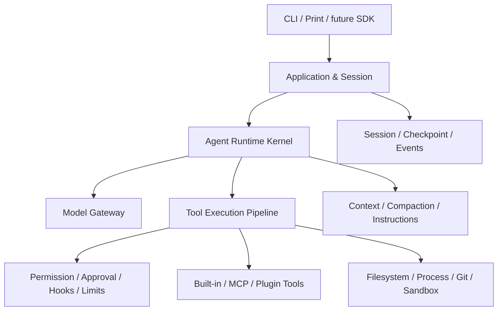

# cc-java

一个以成熟 Coding Agent 为参照、用 Java 独立重实现的学习型 Agent Runtime 与 CLI。

> 当前状态：**S01 Runtime Kernel 已 Accepted，当前位于 S02 启动 Gate**。框架无关领域协议、
> 显式 Agent Loop、Tool Pipeline 和内存 Session 已通过 Commit-scoped 离线验证；
> S02 的 23 项范围已固定，但尚无真实模型和可交互 CLI，生产实现尚未开始。
>
> Current status: S01 accepted; S02 is at its launch gate; no provider or interactive CLI yet.

## 项目目标

这个项目不是先做一个功能有限的聊天 CLI，再凭感觉决定加什么；也不是逐行翻译某份受限制源码。它采用一条可持续验证的学习路径：

```text
登记公开行为范围与来源/权利边界
→ 区分 Documented、Observed、Inferred 与 Unknown
→ 拆解成熟系统的职责、状态和失败路径
→ 用 Java 独立重实现
→ 用场景、测试和指标对照差距
→ 补齐参考能力
→ 在理解之后形成自己的创新
```

长期目标是理解并实现完整的 Coding Agent Harness：Agent Loop、模型适配、工具执行、权限、会话、上下文、配置、Hooks、MCP、Skills、Subagent、Sandbox、可观测性与评测。

FixBug、代码评审和测试生成会成为上层 Skill 或示例场景，不会定义 Runtime Core。

## 如何知道与成熟项目的差距

[功能对照矩阵](./docs/feature-parity-matrix.md)是项目进度的权威账本。每一项参考能力都有稳定 ID，并按以下等级记录：

[项目进度看板](./docs/progress.html)把矩阵、当前 Stage Gate、阻塞项和最近验证生成为
可搜索的单页 HTML，适合日常查看。HTML 是派生展示，发生冲突时仍以功能矩阵和
Stage 证据为准。

| 等级 | 含义 |
| --- | --- |
| L0 | 尚未开始 |
| L1 | 已理解协议并完成学习骨架 |
| L2 | 可在真实任务中使用 |
| L3 | 关键行为和异常路径可与参考基线比较 |
| L4 | 在评测数据支持下形成 Java 生态差异化 |

R2026.03 基线目前追踪 193 个 Capability ID。S01 只把 19 项推进到 L1，
其余 174 项仍为 L0；这表示已经建立可测试学习骨架，不表示可以承担真实编码任务。
默认最终目标为 L3，任何不实现项都必须记录 `Accepted Deviation`。

项目同时度量四件事：

1. **Capability Coverage**：参考能力覆盖了多少；
2. **Behavioral Conformance**：同类任务中的行为是否一致；
3. **Reliability & Safety**：失败、拒绝、取消和越权是否可控；
4. **Learning Evidence**：维护者能否解释设计，并提供 ADR、测试和演示证据。

每个 Stage 统一通过 `来源/权利边界 → 范围/目标等级 → 机制研究/ADR → 独立实现
→ 测试/Eval → Demo → 文档对账` 七道 Gate。参考源码负责提供成熟机制线索，
但只有来源与使用范围可核验时才能成为研究输入；本项目的测试和评测始终负责验证结果。

因此，“下一个功能是什么”不由灵感决定：优先补齐当前 Stage 未达目标等级的矩阵项；完成 S01-S14、关键能力达到可对照的 L3 并建立评测后，才进入独立创新。

## 学习与实现路线

| 阶段 | 学习主题 | 主要结果 |
| --- | --- | --- |
| S00 | Harness 地图 | 参考架构、行为基线、来源隔离登记、能力矩阵和权利边界 |
| S01-S04 | 核心 Coding Loop | Agent Loop、模型流、只读工具、受控修改与测试 |
| S05-S08 | 可靠性 | 权限、Session、Checkpoint、Context、Instructions、Settings |
| S09-S11 | 扩展机制 | Hooks、MCP、Skills、Plugins |
| S12-S13 | 高级执行 | Subagent、任务系统、Worktree、OS Sandbox |
| S14 | 生产化 Harness | 稳定协议、SDK、Headless、遥测、评测、分发 |
| S15 | 独立创新 | Java/Spring 语义能力与企业开发场景 |

S01-S04 会得到第一个可运行的纵向闭环：

```text
用户提出开发任务
→ Agent 搜索并读取代码
→ 请求修改授权
→ 应用 Patch
→ 请求命令执行授权
→ 编译或测试
→ 根据结果继续行动
→ 汇总 Diff、证据和验证结果
```

它是验证 Agent Loop、Tool Calling、Streaming 和审批边界的学习检查点，不代表项目目标已经完成。

## 架构方向



Spring AI 只位于模型和集成适配层。项目自己的 Runtime 掌握 Tool Call、权限、生命周期、限制和终止状态，不能把核心循环交给框架黑盒自动执行。

## 文档导航

建议按以下顺序阅读：

1. [参考架构](./docs/reference-architecture.md)：成熟 Coding Agent 有哪些子系统，以及为什么存在；
2. [公开行为基线](./docs/reference-baselines/R2026.03-public-behavior.md)：来源分类、版本限制和行为证据规则；
3. [未核验参考材料隔离登记](./docs/reference-baselines/R2026.03-unverified-source.md)：为什么该材料不能作为活动输入；
4. [功能对照矩阵](./docs/feature-parity-matrix.md)：我们做到哪里、还差什么；
5. [项目进度看板](./docs/progress.html)：当前 Stage、Gate、阻塞项和 193 项 Capability 的可视化；
6. [产品需求](./docs/product-requirements.md)：学习型产品边界和阶段验收；
7. [技术设计](./docs/technical-design.md)：Java 架构、协议和实现约束；
8. [ADR-020](./docs/adr/ADR-020-quarantine-unverified-reference-source.md)：撤销不可核验的授权分类并隔离历史结论；
9. [ADR-021](./docs/adr/ADR-021-s02-model-streaming-cli-scope.md)：S02 的 23 项范围、目标等级和 Spike；
10. [ADR-018（历史）](./docs/adr/ADR-018-authorized-reference-study.md)与
    [ADR-019（历史）](./docs/adr/ADR-019-s07-progressive-context-reduction.md)：已被 ADR-020 取代的决策记录；
11. [Stage 证据包模板](./docs/templates/stage-evidence-package.md)：每个阶段统一的 G0-G6 Gate；
12. [S01 Runtime Kernel ADR](./docs/adr/ADR-017-s01-runtime-kernel.md)：首个代码阶段的关键取舍；
13. [S01 离线 Demo](./docs/demos/S01-agent-loop.md)：如何复现 Fake Model 协议闭环；
14. [S01 标准验证证据](./docs/evidence/S01-runtime-kernel-2026-07-28.md)：Wrapper、标准命令、报告与正反例实际结果；
15. [S01 差距报告](./docs/gap-reports/S01.md)：已经学到什么，以及仍缺什么；
16. [AGENTS.md](./AGENTS.md)：人类与 AI 贡献者必须遵循的规则。

## 技术基线

S01 已确认：

- Java 21；
- Maven Wrapper 3.3.4，固定 Maven 3.9.16；
- JUnit 5.14.3；
- AssertJ 3.27.7；
- GroupId `io.github.liumaishenjian`；
- Java 根包 `io.github.liumaishenjian.ccjava`。

Spring Boot、Spring AI、Picocli、JLine 和首个模型 Provider 都延后到真正使用它们的
S02 再确认，S01 不为了占位引入框架依赖。

## S01 能做什么

当前代码已经能够在无网络、无 API Key 的测试中验证：

- User → Model → Tool → Model → Final 的显式循环；
- 同一模型回合多个 Tool Call 的顺序和 Call ID 对应关系；
- 未知 Tool、无效参数和 Tool 异常的结构化结果回传；
- 模型回合与 Tool Call 上限，以及 Tool 批次的原子预算预检；
- 同一内存 Session 中多个 Run 的连续消息历史；
- Session/Run/Model/Permission/Tool 的有序事件和唯一 Run 终态。

当前明确不能连接真实模型、读取或修改仓库、执行命令、显示交互终端、跨进程恢复会话，
也不具备完整权限策略、取消、超时或 OS Sandbox。

## 构建与离线 Demo

前置条件是 JDK 21。Windows PowerShell：

```powershell
java -version
.\mvnw.cmd clean verify
.\mvnw.cmd -DskipTests javadoc:aggregate
.\mvnw.cmd -pl cc-java-core -am test
```

Linux/macOS 使用 `./mvnw`。最后一条命令中的 Core 协议测试就是 S01 Demo；
它只使用测试源中的 Scripted Fake Model 和 Fake Tool。

> 2026-07-28 已修复 Windows `mvnw.cmd` 在普通 `.m2` 目录上的启动缺陷，并用
> Wrapper 固定的 Maven 3.9.16 完成 `clean verify`、聚合 Javadoc 和 Core 23/23
> 标准测试；包含预算拒绝负例的聚焦 Demo 也以 5/5 通过。完整证据见
> [S01 标准验证证据](./docs/evidence/S01-runtime-kernel-2026-07-28.md)。
> 相同命令已在 Commit `5ef0bbbf54c75fcc3c8479c2c52bfbaa29beaabd` 的 Clean
> 工作区上复验；G0-G6 与 S01 Stage Exit 已通过。S02 当前仅通过启动范围 G1；
> 下一步先完成官方来源/版本核验和 Provider/Streaming/CLI Spike。

### 更新项目进度看板

进度看板使用 JDK 21 的单文件源码模式生成，不需要额外依赖：

```powershell
java scripts/ProgressDashboard.java
java scripts/ProgressDashboard.java --check
java scripts/ProgressDashboard.java --self-test
```

第一条命令根据功能矩阵和 `docs/progress-state.properties` 生成
`docs/progress.html`；第二条命令只检查生成结果是否最新，过期时返回失败。
生成结果还包含 Java 源码、POM、Wrapper 和仓库脚本的摘要，所以代码变更后未重新生成
看板也会被 `--check` 识别。
如果代码输入或功能矩阵的摘要发生变化，生成器会先要求把它报告的当前值写入
`progress-state.properties` 的 `inputs.code.digest` 或 `inputs.matrix.digest`；
这一步用于强制重新审视 `last.change`、Gate、证据和能力等级，而不只是重新生成 HTML。
所有代码、构建脚本和 Capability/Stage 变更都必须按 [AGENTS.md](./AGENTS.md)在同一
变更中更新看板。禁止手工修改 HTML。

## 来源与独立重实现边界

项目只使用公开文档、可独立复现的行为场景和本项目需求定义可验收行为。此前登记为
“已授权”的本地参考材料缺少可核验的来源、Revision、许可证和授权范围，现已改为
`UNVERIFIED-SRC-2026-03-31-A` 并隔离，不再作为需求、设计、测试或代码输入。

参考材料不得进入本仓库、依赖、子模块、Fixture、Golden Output 或发布物。禁止复制或
逐行翻译函数体、内部 Prompt、注释、错误文案、私有类型名、文件布局和实现常量。
Java 侧必须使用本项目能够独立解释的契约、命名和实现。当前规则见
[ADR-020](./docs/adr/ADR-020-quarantine-unverified-reference-source.md)。

“用于学习”或“不商用”不会自动获得复制和再发布权限；来源或授权范围不清楚时停止使用。

## 当前仓库结构

```text
cc-java/
├─ .mvn/wrapper/
├─ cc-java-domain/
├─ cc-java-core/
├─ cc-java-model-spring-ai/
├─ cc-java-tools-local/
├─ cc-java-cli/
├─ scripts/
│  └─ ProgressDashboard.java
├─ AGENTS.md
├─ README.md
├─ pom.xml
├─ mvnw
├─ mvnw.cmd
└─ docs/
   ├─ adr/
   ├─ demos/
   ├─ gap-reports/
   ├─ reference-baselines/
   ├─ templates/
   ├─ feature-parity-matrix.md
   ├─ progress-state.properties
   ├─ progress.html
   ├─ product-requirements.md
   ├─ reference-architecture.md
   └─ technical-design.md
```

## License

许可证尚未确定，也暂不接受外部代码贡献。

如果含义是“维护者本人暂不商业化”，可以选择 Apache-2.0 或 MIT，并仍属于开源软件；
如果许可证要禁止他人商用，则应明确称为 source-available，而不是 OSI 意义上的
Open Source。在该决策完成前不要复制、分发或接受外部贡献。

## 声明

本项目是独立学习与开源实验，不隶属于或代表 Anthropic、OpenAI、Spring 或其他 Coding Agent 产品。仓库不得包含泄露源码、公司私有代码、真实凭证或未脱敏业务数据。
