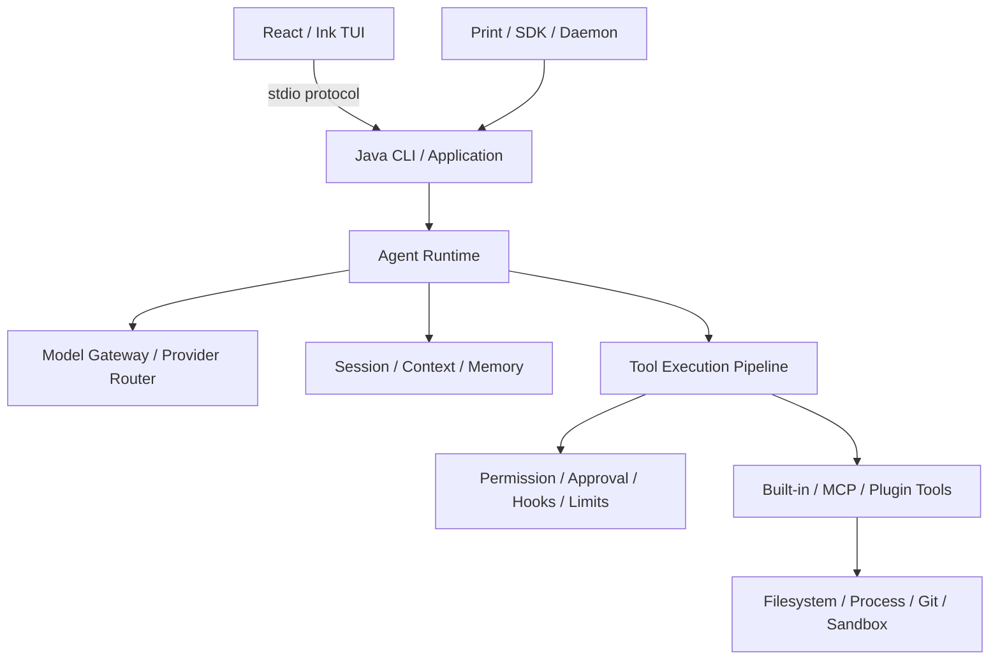

# codej

用 Java 实现的开源 Coding Agent CLI。

`codej` 可以在终端中理解代码仓库、搜索和读取文件、修改代码、执行命令、运行测试，并在有副作用的操作前进入统一的权限与审批流程。它不是对模型 API 的简单命令行包装：Agent Loop、Tool Pipeline、Session、Context、Permission 和扩展机制都由项目自己的 Java Runtime 管理。

> 项目聚焦 Coding Agent 的底层机制与工程实现，不以复刻某个产品的界面为目标。核心运行时、安全边界和扩展协议均采用可独立解释、可测试的 Java 设计。

[官网](https://codej.sixmai.top) · [架构设计](./docs/technical-design.md) · [能力矩阵](./docs/feature-parity-matrix.md) · [项目看板](./docs/progress.html)

## 它能做什么

- 交互式 TUI 与 `--print` 非交互模式，共用同一个 Java Agent Runtime；
- 流式模型输出、原始 Tool Call、多轮工具循环和严格的 Call/Result ID 对应；
- 仓库搜索、文件读取、精确 Patch、新文件写入、Git 状态与受控命令执行；
- Permission、Approval、Hard Denial、超时、取消、输出上限和敏感信息脱敏；
- 可恢复 Session、Checkpoint、Diff/Undo、Context 压缩、文件记忆与 Instructions；
- Hooks、MCP、Skills、Plugins、Subagent、Worktree 和后台任务；
- OpenAI-compatible、Anthropic、OpenRouter 的本地 BYOK 配置；
- Windows/Linux 自包含发行包、checksum、SBOM、版本切换和回滚安装链。

## 技术栈

| 层次 | 技术 | 在项目中的职责 |
| --- | --- | --- |
| 核心语言 | **Java 21** | Agent Runtime、领域协议、权限、会话、上下文和工具执行 |
| 模型适配 | **Spring AI 2.0.0 + Reactor** | 模型流、Tool Call 与多 Provider Adapter；不接管 Agent Loop |
| CLI | **Picocli 4.7.7** | Headless、Print、Provider/Auth 与运维命令 |
| 终端 UI | **React 19.2.8 + Ink 7.1.1 + TypeScript 7** | 流式 TUI、审批面板、Markdown 和交互输入 |
| 协议与扩展 | **MCP Java SDK 2.0.0、JSON-RPC、stdio、HTTP/SSE** | MCP、Plugin、Hook 与 Java/TUI 边界 |
| 数据与序列化 | **Jackson 3.1.0、JSONL** | 稳定协议、Session Journal、Checkpoint 与配置 |
| 可观测性 | **OpenTelemetry 1.54.1** | Run/Turn/Tool 指标与隐私安全遥测 |
| 测试 | **JUnit 5.14.3、AssertJ 3.27.7、Vitest 4.1.10** | Fake Model/Tool、协议、安全攻击与 TUI 回归 |
| 构建与发行 | **Maven 3.9.16、Node.js 22、GitHub Actions、jlink** | 多模块构建、自包含运行时、checksum 与 SBOM |
| 执行隔离 | **WSL2 + bubblewrap、Docker** | Linux 文件/进程/网络隔离与容器执行后端 |

## 架构



模块依赖保持单向：

```text
cc-java-domain
        ↑
cc-java-core
    ↑           ↑
model-adapter   tool-adapters
        \       /
        cc-java-cli
             ↑
        cc-java-tui
```

`domain` 和 `core` 不依赖 Spring AI、Picocli、React、文件系统或持久化框架。Spring AI 只负责模型协议转换，TUI 只消费事件；是否执行工具、何时停止、如何取消和如何记录状态，由 Java Runtime 确定。

## 核心设计

### 1. 显式 Agent Loop

项目没有把完整循环交给 Spring AI。`ModelGateway` 只完成一个模型回合并返回原始 Tool Call，Runtime 负责多轮调度、预算、取消、终止状态以及多 Tool Call 的协议顺序，因此核心逻辑可以用 Scripted Fake Model 在离线环境中确定性测试。

### 2. 统一 Tool Pipeline

内置 Tool、MCP Tool 和 Plugin Tool 都经过同一条执行链：

```text
参数校验 → Permission → Approval → Hook → Execute → Truncate → Redact → Tool Result
```

模型只能提出操作意图，不能绕过应用代码直接访问文件系统、Shell 或网络。

### 3. 安全边界不是 Prompt

路径 realpath、Traversal、Symlink/Junction、敏感文件、最小子进程环境、命令超时和进程树清理由确定性代码执行。Permission、Checkpoint 和普通本地进程不会被描述成 OS Sandbox；只有通过真实探测的 WSL2/bubblewrap 或 Docker 后端才报告对应隔离能力。

### 4. 可恢复状态与上下文工程

Session 使用 append-only JSONL 保存语义事件，支持 Create、Continue、Resume、Fork 和未完成副作用恢复 Gate。Context 层把 Canonical Transcript 与模型 Projection 分开，提供有界压缩、溢出恢复、文件记忆和零等待预取。

### 5. 可扩展但不破坏核心

Hooks、MCP、Skills、Plugins 和 Subagent 都通过 Adapter/Port 接入，并继续服从同一 Permission 与 Tool Pipeline。Core 不依赖具体 Transport、模型 SDK 或终端实现。

### 6. 生产工程闭环

项目包含稳定协议、Java SDK、Daemon、OpenTelemetry、配置迁移、故障恢复、跨平台 CI、自包含运行时、checksum、CycloneDX-compatible SBOM、安装更新和回滚，而不只停留在能演示一次的 Agent Demo。

## 快速开始

### 正式安装

首个公开 Release 正在完成最终发布对账。在 GitHub Release 与官网安装端点上线后，可使用：

Windows PowerShell：

```powershell
irm https://codej.sixmai.top/install.ps1 | iex
```

Linux：

```bash
curl -fsSL https://codej.sixmai.top/install.sh | sh
```

发行包内置 Java 与 Node Runtime，最终用户不需要单独安装 JDK、Maven 或 npm。当前已验证 Windows x64 与 Linux x64；macOS 尚未提供正式发行物。

### 从源码运行

开发环境需要 JDK 21、Node.js 22 和 PowerShell 7。Windows：

```powershell
pwsh -NoProfile -File .\scripts\InstallCodejDevCommand.ps1 `
  -AddToUserPath
```

新开终端后，在任意代码仓库运行：

```powershell
codej
codej --print "解释这个项目的核心架构"
codej --doctor
```

交互模式使用 `/connect` 配置模型。也可以使用脚本化命令：

```powershell
codej auth login --provider anthropic --profile personal --set-default
codej auth login --provider openrouter --profile personal `
  --from-env OPENROUTER_API_KEY --set-default
codej providers list
codej models list --provider anthropic
```

不带 `--from-env` 时，API Key 由 Java masked Console 读取，不经过 Ink/Node，也不会写入 Session、日志或命令参数。原有 OpenAI-compatible 本地配置方式见 [`config/provider.local.properties.example`](./config/provider.local.properties.example)。

## 构建与测试

Windows：

```powershell
.\mvnw.cmd clean verify
npm --prefix cc-java-tui ci
npm --prefix cc-java-tui run check
java scripts/ProgressDashboard.java --check
```

Linux 使用 `./mvnw clean verify`。真实模型测试需要显式配置 Provider；普通测试依赖 Fake Model 和 Fake Tool，可以在无网络、无 API Key 的环境运行。

最近一次正式 `0.1.0` 基线验证为 Maven 1,012 tests / 32 skips / 0 failures / 0 errors，TUI 194/194；Windows/Linux 自包含打包也已在 GitHub-hosted runner 通过。详细结果见 [S14 发行证据](./docs/evidence/S14-installable-cli-2026-08-16.md)。

## 仓库结构

```text
cc-java-domain              # 框架无关协议与值对象
cc-java-core                # Agent Runtime、Pipeline、Session、Context
cc-java-model-spring-ai     # Spring AI Provider Adapter
cc-java-tools-local         # 文件、搜索、Patch 与命令工具
cc-java-tools-web           # 受控 Web Search
cc-java-mcp                 # MCP Transport 与 Tool Adapter
cc-java-protocol            # 稳定协议
cc-java-sdk                 # Java SDK
cc-java-observability-otel  # OpenTelemetry Adapter
cc-java-cli                 # Java Composition Root / Headless CLI
cc-java-tui                 # React / Ink 终端界面
docs                        # ADR、证据、Demo、Gap 与能力矩阵
```

## 文档

- [参考架构](./docs/reference-architecture.md)：Coding Agent 子系统与职责地图；
- [产品需求](./docs/product-requirements.md)：产品范围和行为要求；
- [技术设计](./docs/technical-design.md)：模块边界、协议和安全不变量；
- [功能对照矩阵](./docs/feature-parity-matrix.md)：所有 Capability 的当前等级；
- [项目进度看板](./docs/progress.html)：Stage、Gate、证据和阻塞项；
- [ADR](./docs/adr/)：关键架构决策；
- [Demo](./docs/demos/)：可复现的行为场景；
- [Gap Reports](./docs/gap-reports/)：已知限制与未完成项。

README 只提供项目入口。精确能力状态以功能矩阵为准，测试与发布结论以对应 Evidence 为准。

## 项目状态与边界

S01–S14 已完成阶段验收；S15 的 Web Search 与本地 Provider/Auth 已进入主分支。当前仍缺少双 Provider 在线完整证据和独立创新 L4 A/B Eval，因此不会把 S15 描述成已经关闭。

模型输出、仓库文件、Tool 参数与外部内容都按不可信输入处理。即使启用了审批或本地 Permission，也不能将其等同于操作系统级隔离。

## License

[Apache License 2.0](./LICENSE)

本项目为独立开源实现，不隶属于或代表 Anthropic、OpenAI、OpenCode、Spring 或其他 Coding Agent 产品。仓库不得包含泄露源码、公司私有代码、真实凭证或未脱敏业务数据。
