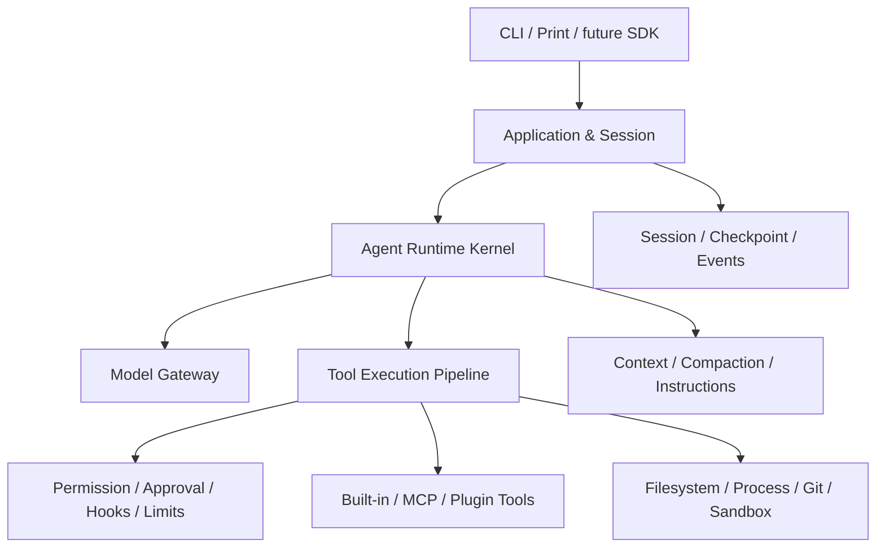

# cc-java

一个以成熟 Coding Agent 为参照、用 Java 独立重实现的学习型 Agent Runtime 与 CLI。

> 当前状态：**S00 参考架构与学习地图**。仓库尚不可运行，也没有创建 Maven 模块。
>
> Current status: reference architecture and learning map; no implementation yet.

## 项目目标

这个项目不是先做一个功能有限的聊天 CLI，再凭感觉决定加什么；也不是逐行翻译某份受限制源码。它采用一条可持续验证的学习路径：

```text
建立公开参考基线
→ 拆解成熟系统的职责与行为
→ 用 Java 独立重实现
→ 用场景、测试和指标对照差距
→ 补齐参考能力
→ 在理解之后形成自己的创新
```

长期目标是理解并实现完整的 Coding Agent Harness：Agent Loop、模型适配、工具执行、权限、会话、上下文、配置、Hooks、MCP、Skills、Subagent、Sandbox、可观测性与评测。

FixBug、代码评审和测试生成会成为上层 Skill 或示例场景，不会定义 Runtime Core。

## 如何知道与成熟项目的差距

[功能对照矩阵](./docs/feature-parity-matrix.md)是项目进度的权威账本。每一项参考能力都有稳定 ID，并按以下等级记录：

| 等级 | 含义 |
| --- | --- |
| L0 | 尚未开始 |
| L1 | 已理解协议并完成学习骨架 |
| L2 | 可在真实任务中使用 |
| L3 | 关键行为和异常路径可与参考基线比较 |
| L4 | 在评测数据支持下形成 Java 生态差异化 |

R2026.03 基线目前追踪 193 个 Capability ID；代码尚未开始，因此全部为 L0，差距是显式的而不是未知的。默认最终目标为 L3，任何不实现项都必须记录 `Accepted Deviation`。

项目同时度量四件事：

1. **Capability Coverage**：参考能力覆盖了多少；
2. **Behavioral Conformance**：同类任务中的行为是否一致；
3. **Reliability & Safety**：失败、拒绝、取消和越权是否可控；
4. **Learning Evidence**：维护者能否解释设计，并提供 ADR、测试和演示证据。

因此，“下一个功能是什么”不由灵感决定：优先补齐当前 Stage 未达目标等级的矩阵项；完成 S01-S14、关键能力达到可对照的 L3 并建立评测后，才进入独立创新。

## 学习与实现路线

| 阶段 | 学习主题 | 主要结果 |
| --- | --- | --- |
| S00 | Harness 地图 | 参考架构、能力矩阵、clean-room 边界 |
| S01-S04 | 核心 Coding Loop | Agent Loop、模型流、只读工具、受控修改与测试 |
| S05-S08 | 可靠性 | 权限、Session、Checkpoint、Context、Instructions、Settings |
| S09-S11 | 扩展机制 | Hooks、MCP、Skills、Plugins |
| S12-S13 | 高级执行 | Subagent、任务系统、Worktree、OS Sandbox |
| S14 | 生产化 Harness | 稳定协议、SDK、Headless、遥测、评测、分发 |
| S15 | 独立创新 | Java/Spring 语义能力与企业开发场景 |

S01-S04 会得到第一个可运行的纵向闭环：

```text
用户提出开发任务
→ Agent 搜索并读取代码
→ 请求修改授权
→ 应用 Patch
→ 请求命令执行授权
→ 编译或测试
→ 根据结果继续行动
→ 汇总 Diff、证据和验证结果
```

它是验证 Agent Loop、Tool Calling、Streaming 和审批边界的学习检查点，不代表项目目标已经完成。

## 架构方向



Spring AI 只位于模型和集成适配层。项目自己的 Runtime 掌握 Tool Call、权限、生命周期、限制和终止状态，不能把核心循环交给框架黑盒自动执行。

## 文档导航

建议按以下顺序阅读：

1. [参考架构](./docs/reference-architecture.md)：成熟 Coding Agent 有哪些子系统，以及为什么存在；
2. [功能对照矩阵](./docs/feature-parity-matrix.md)：我们做到哪里、还差什么；
3. [产品需求](./docs/product-requirements.md)：学习型产品边界和阶段验收；
4. [技术设计](./docs/technical-design.md)：Java 架构、协议和实现约束；
5. [AGENTS.md](./AGENTS.md)：人类与 AI 贡献者必须遵循的规则。

## 技术基线

当前拟定：

- Java 21；
- Maven Wrapper 3.9.x；
- Spring Boot 4.1.x；
- Spring AI 2.0.x；
- Picocli + JLine；
- JUnit 5。

具体版本和首个模型 Provider 会在 S01 开始前通过 ADR 确认。初始模块计划为 `domain`、`core`、`model-spring-ai`、`tools-local` 和 `cli`；当前阶段不会提前创建空模块。

## Clean-room 边界

本项目只把公开文档、公开可观察行为和通用架构思想转化为需求，再进行独立命名、设计和实现。

禁止复制或翻译泄露/受限制源码，禁止复制其内部 Prompt、注释、错误文案、私有类型命名和文件布局，也不会把相关仓库作为依赖、子模块或测试素材。“用于学习”或“不商用”不会自动获得复制和再发布权限。

## 当前仓库结构

```text
cc-java/
├─ AGENTS.md
├─ README.md
└─ docs/
   ├─ feature-parity-matrix.md
   ├─ product-requirements.md
   ├─ reference-architecture.md
   └─ technical-design.md
```

## License

许可证尚未确定，也暂不接受外部代码贡献。

如果含义是“维护者本人暂不商业化”，可以选择 Apache-2.0 或 MIT，并仍属于开源软件；如果许可证要禁止他人商用，则应明确称为 source-available，而不是 OSI 意义上的 Open Source。该决策会在开始实现前确认。

## 声明

本项目是独立学习与开源实验，不隶属于或代表 Anthropic、OpenAI、Spring 或其他 Coding Agent 产品。仓库不得包含泄露源码、公司私有代码、真实凭证或未脱敏业务数据。
