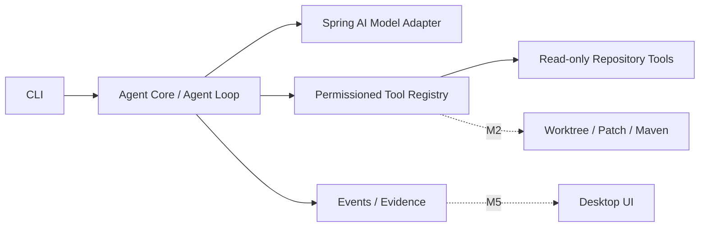

# cc-java

面向 Java/Spring 仓库的安全型 Coding Agent：从代码调查开始，逐步实现隔离修复、Maven 验证和人审 FixBug 工作流。

> 当前状态：**M0 文档设计阶段**。项目尚不可运行，也还没有创建 Maven 模块。
>
> Current status: documentation-first design; no runnable implementation yet.

## 为什么做这个项目

AI 生成代码已经很容易，但可靠修复一个真实缺陷还需要理解上下文、调用工具、控制权限、验证结果并留下可复核证据。

`cc-java` 不是“大模型套一个聊天框”，也不追求一开始复刻完整商业 Coding Agent。它首先完成一条能被测试的 Java 垂直链路：

```text
提出代码问题
→ 受限地搜索和读取仓库
→ 输出带文件证据的调查结论
→ 在独立 Worktree 生成候选补丁
→ 编译和测试
→ 交给开发者审核
```

## 产品目标

- Java-first：核心、工具和工作流使用 Java 实现。
- Safety-first：模型只提出请求，应用代码决定能否执行。
- Evidence-first：区分事实、推断、未知项和建议步骤。
- Human-in-the-loop：补丁默认需要人工审核，不自动推送或合并。
- Extensible：后续可接入 MCP、缺陷系统、日志、测试数据库和桌面端。

## 路线图

| 里程碑 | 交付内容 | 状态 |
| --- | --- | --- |
| M0 | 需求、技术设计、协作规则 | 进行中 |
| M1 | 只读代码调查 Agent | 未开始 |
| M2 | Worktree、受控补丁、Maven 验证、人审报告 | 未开始 |
| M3 | 缺陷摄取、信息检查、调查/修复状态机 | 未开始 |
| M4 | MCP、项目指令、私有适配器 SPI、回放评测 | 未开始 |
| M5 | 桌面端会话、进度、审批和 Diff 展示 | 未开始 |

第一个可运行版本只提供计划中的命令：

```text
cc-java investigate --repo <path> --question <text>
```

在 M1 完成前，这只是接口草案，不是当前可执行命令。

## 架构方向



核心 Agent Loop 不依赖 Spring AI 类型，Spring AI 只负责模型协议适配。工具执行、权限、限制和审计由项目自身控制。

## 安全边界

M1 的硬边界：

- 只允许列目录、读文件、搜索文本和查看 Git Diff；
- 不提供写文件和任意 Shell；
- 拒绝绝对路径、路径穿越、符号链接/Junction 越界；
- 默认拒绝敏感文件并限制大小和结果数量；
- 默认不记录完整 Prompt、源码、工具参数或 API Key。

M2 即使开始修改代码，也只会在任务独立的 Git Worktree 中进行，并且默认禁止 commit、push、merge、PR 和外部缺陷系统写入。

## 技术基线

当前建议、尚待 M0 最终确认：

- Java 21 LTS（框架最低 Java 17）
- Maven Wrapper 3.9.x
- Spring Boot 4.1.0
- Spring AI 2.0.0
- Picocli
- JUnit 5

## 文档

- [产品需求文档](./docs/product-requirements.md)
- [技术设计文档](./docs/technical-design.md)
- [贡献者与 AI 协作规则](./AGENTS.md)

产品范围以需求文档为准，架构和技术决策以技术设计为准。代码开始后，每项能力都应能追踪到 `FR-*` 或 `NFR-*`。

## 仓库结构

当前结构：

```text
cc-java/
├─ AGENTS.md
├─ README.md
└─ docs/
   ├─ product-requirements.md
   └─ technical-design.md
```

M1 计划采用五个最小模块：domain、core、Spring AI model adapter、local tools 和 CLI。后续模块只在对应里程碑开始时创建。

## 参与项目

当前最有价值的贡献是审阅产品边界、验收标准、安全规则和技术决策。请先阅读 `AGENTS.md`，不要在 M0 阶段提前加入实现或依赖。

## License

许可证尚未确定。开始接受外部代码贡献前，将在 Apache-2.0 与 MIT 等候选中完成选择并添加 `LICENSE`。

## 声明

本项目是独立开源实验，不隶属于或代表 Anthropic、OpenAI、Spring 或其他 Coding Agent 产品。项目不得包含泄露源码、公司私有代码、真实凭证或未脱敏业务数据。
