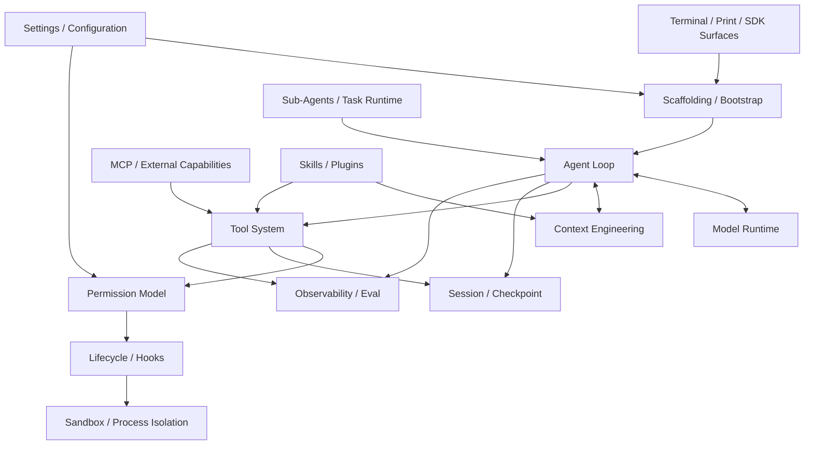

# Coding Agent 参考架构研究

> 文档状态：Research Baseline R2026.03
>
> 最后更新：2026-07-28
>
> 用途：定义 `cc-java` 学习和 Java 重实现时的参考目标

## 1. 研究目标

本文档不是某份源码的翻译说明，而是把成熟 Coding Agent 的公开行为和已授权材料中可解释的
机制拆解为可以学习、独立实现和验证的子系统。

它解决三个问题：

1. 一个成熟 Coding Agent Harness 到底包含哪些部分；
2. 每个部分解决什么生产问题；
3. `cc-java` 应如何用 Java 独立重实现，并知道自己还缺什么。

功能完成度统一记录在 [功能对照矩阵](./feature-parity-matrix.md)。

## 2. 参考基线

为了避免参考产品持续更新导致目标无限移动，项目登记第一版研究范围：

> **Reference Baseline R2026.03**

来源清单、分类、登记日期和可复现限制见
[R2026.03 公开行为基线](./reference-baselines/R2026.03-public-behavior.md)。
当前只固定来源 Manifest；在线页面没有归档或内容指纹，历史内容不可字节复现。
因此该 ID 表示第一轮能力范围，不表示所有网页都已冻结在 2026 年 3 月。第三方二手分析
只作为 `Inferred` 研究问题，不能单独定义参考产品行为。

项目同时登记仓库外的
[授权参考源码快照 `AUTH-SRC-2026-03-31-A`](./reference-baselines/R2026.03-authorized-source.md)。
该快照用于解释职责、状态机、不变量、失败恢复和验证方法，不替代公开行为基线，也不自动
成为需求或正确性证明。

官方 Claude Code 仓库的 [LICENSE](https://github.com/anthropics/claude-code/blob/main/LICENSE.md)
标明“All rights reserved”。该文件只能说明官方仓库所载材料的条款，不能证明第三方仓库
或本地快照适用同一许可。授权学习也不会自动产生复制、再发布或派生分发权利。因此所有
Java 契约、命名、实现和测试仍须独立产生，不复制受限制源码表达。

参考结论使用三种置信度：

- `Documented`：在访问当日由官方文档直接说明，但未必经过黑盒观察；
- `Observed`：当前材料或独立黑盒场景可以直接确认；
- `Inferred`：根据状态和调用关系作出的解释，需要反例或实验验证；
- `Unknown`：因快照缺失、不可运行或版本不明而不能确认。

本文各子系统的“参考能力”列表是由公开资料和研究问题合成的目标目录，不表示每一项都已
由授权快照验证。凡引用授权快照得出的具体机制结论，统一在
[授权参考源码基线](./reference-baselines/R2026.03-authorized-source.md)中逐项标记；
未标记的目录项不得被解释为 `Observed`。

## 3. 学习方法

每个子系统保留 Observe、Explain、Reimplement、Compare 的学习循环，但必须通过统一的
G0-G6 证据 Gate：

```text
G0 来源、授权与快照
→ G1 Stage、Feature、当前等级与退出目标
→ G2 Observe / Explain / ADR
→ G3 Java Independent Reimplementation
→ G4 Test / Fault Injection / Behavior Compare
→ G5 Reproducible Demo
→ G6 Matrix / Capability Claim / Gap Reconciliation
```

### Observe

从公开文档、独立产品行为和已授权材料中记录输入、输出、状态和边界。公开资料结论必须
标记 `Documented / Observed / Inferred / Unknown`，授权源码结论只使用后三类，不得
用推测填补快照缺失。

### Explain

用自己的语言回答：

- 为什么需要这个组件；
- 它避免了什么失败；
- 它与上下游的契约是什么；
- 最小实现和成熟实现差在哪里。

### Reimplement

根据 `cc-java` 自己的接口和测试，用 Java 独立实现行为。

### Compare

用 Feature Matrix、行为测试、错误恢复测试和指标更新差距，而不是凭主观感觉判断“像不像”。

完整字段和退出条件见 [Stage 证据包模板](./templates/stage-evidence-package.md)。授权源码研究
结论进入产品、设计或代码前，必须先通过
[ADR-018](./adr/ADR-018-authorized-reference-study.md)规定的采纳 Gate。

## 4. 参考架构全景



Agent Loop 的代码可以很短；成熟度主要来自围绕循环建立的控制、上下文、恢复和扩展设施。

## 5. 子系统一：Scaffolding / Bootstrap

### 解决的问题

在第一次模型请求前，把运行环境组装成一个稳定、可解释的 Agent Session。

### 参考能力

- 解析 CLI 参数和运行模式；
- 确定 Workspace 与 Git 状态；
- 加载配置、项目指令和模型；
- 选择工具集合与权限模式；
- 创建 Session；
- 收集 OS、Shell、终端和模型能力；
- 并行或延迟加载不影响正确性的启动信息。

### Java 重实现目标

- Composition Root 只存在于 CLI/App；
- `SessionBootstrapper` 生成不可变 Runtime Scope；
- Bootstrap 与 Agent Loop 分离；
- 启动诊断能够解释模型、Workspace、配置和工具来源。

### 学习问题

- 哪些配置必须在第一轮前固定？
- 哪些资源可以懒加载？
- Session 中途切换模型或模式时，哪些状态需要重建？

## 6. 子系统二：Terminal / Interface

### 解决的问题

让长时间运行、持续输出、需要审批的 Agent 仍然可以被用户观察、取消和纠正。

### 参考能力

- 交互会话与一次性 Print；
- 流式文本和工具进度；
- 多行输入、历史和 Slash Command；
- Permission Prompt；
- Cancel、Interrupt 和 Steering；
- 人类文本、JSON 或 JSONL 输出；
- TTY 与非 TTY 降级；
- 不同 Surface 共享同一 Runtime。

### Java 重实现目标

- Picocli 负责进程入口；
- JLine 负责 REPL；
- Terminal 只消费 Agent Event；
- Runtime 不依赖 ANSI 或 JLine；
- 后续 SDK、API 和桌面端复用同一事件协议。

### 学习问题

- 流式输出时如何保护用户正在输入的行？
- `Ctrl+C` 是取消当前 Tool、当前 Run，还是退出 Session？
- 非交互模式遇到 ASK 权限时如何终止？

## 7. 子系统三：Agent Loop

### 解决的问题

把“消息 → 模型 → 工具 → 结果 → 模型”变成可恢复、可终止和可观察的运行时。

### 参考能力

- 显式 State；
- 流式模型回合；
- 单回合多个 Tool Call；
- Tool Result 对应 Call ID；
- 多种 Continue 与 Stop 原因；
- 最大回合、预算和总时间；
- 模型错误、上下文溢出和输出截断恢复；
- 用户取消和中途新消息；
- 不同模型 Fallback。

### Java 重实现目标

- 核心持有 User-Controlled Loop；
- Spring AI 只负责 Model Adapter；
- 同步控制流配合有序事件；
- 所有循环分支有 Stop Reason；
- 使用 Scripted Model 确定性重放。

### 学习问题

- 为什么 Tool Call 和 Tool Result 必须成对？
- 为什么模型流必须先聚合才能执行 Tool？
- 哪些错误应该返回模型纠正，哪些应该终止 Run？
- 如何阻止无限恢复循环？

## 8. 子系统四：Model Runtime

### 解决的问题

屏蔽不同 Provider 的消息、流式、Tool Call、Usage 和错误差异。

### 参考能力

- 模型选择和能力检测；
- 流式文本；
- Tool Calling；
- Thinking / Reasoning 内容；
- Usage、成本和速率限制；
- Prompt Cache；
- Retry、Fallback 和降级；
- Provider 认证和代理。

### Java 重实现目标

- `ModelGateway` 保持 Provider-neutral；
- Spring AI 类型不进入 Core；
- 首个 Provider 验证路径，第二个 Provider 验证抽象；
- 模型能力显式建模，不假设所有 Provider 相同；
- Fallback 晚于单 Provider 稳定实现。

### 学习问题

- Provider-neutral 应抽象到哪一层才不过度？
- Streaming Tool Call 如何跨 Chunk 聚合？
- Usage 缺失或口径不一致时如何处理？

## 9. 子系统五：Tool System

### 解决的问题

让模型通过标准、受控、可观察的方式影响外部环境。

### 参考能力

- Tool Definition、Schema 和描述；
- Tool Registry；
- Built-in、MCP、Plugin 等来源；
- Tool 发现和延迟加载；
- 参数校验；
- 顺序与并行执行；
- 流式输出；
- Timeout、Cancel 和 Error；
- 结果裁剪、脱敏和摘要；
- Tool 生命周期事件。

### Java 重实现目标

- 所有工具进入统一 Tool Execution Pipeline；
- Tool API 不依赖 Spring AI `@Tool`；
- Tool 具有 Effect 和 Source 元数据；
- 先实现最小文件、搜索、Patch 和 Command；
- MCP 和 Plugin 只作为新的 Tool Source。

### 学习问题

- Tool 数量增加为何会影响 Context 和模型选择？
- 什么条件下多个 Tool Call 可以并行？
- Tool Error 是异常、Tool Result，还是两者都有？

## 10. 子系统六：Permission Model

### 解决的问题

在不完全阻断 Agent 能力的情况下，控制真实环境副作用。

### 参考能力

- Read、Write、Process、Network 等风险分类；
- Manual、Accept Edits、Plan、Auto 等模式；
- Allow、Ask、Deny Rule；
- Session Approval；
- Protected Paths；
- 组织、项目和用户策略；
- 拒绝追踪与降级；
- 模型安全分类器；
- 不可覆盖的 Hard Denial。

### Java 重实现目标

- 从 `DEFAULT` 与 `PLAN` 开始；
- Read 默认允许，Patch 和 Shell 默认询问；
- 决策顺序显式化；
- Approval 限定准确范围；
- Permission 与 OS Sandbox 明确分开；
- 逐步增加规则和模式，不追求格式兼容。

### 学习问题

- 为什么 Prompt 规则不能代替 Permission？
- “允许当前 Session”应该匹配 Tool、路径还是命令模式？
- Permission Rule 如何避免过宽和难以解释？

## 11. 子系统七：Lifecycle / Hooks

### 解决的问题

允许用户和组织在不修改 Runtime 的情况下观察、阻断和扩展生命周期。

### 参考能力

- Session、Run、Model、Tool、Permission、Compact、Sub-Agent 等事件；
- Pre 和 Post Hook；
- Command、HTTP、Prompt、Agent Hook；
- Matcher；
- JSON 输入输出；
- Timeout 和异步执行；
- Blocking 与 Non-blocking Error；
- Hook 递归和安全限制。

### Java 重实现目标

- 首先建立内部 Lifecycle Event；
- 所有 Tool 在权限前后产生事件；
- 后续将部分事件安全暴露为用户 Hook；
- Hook 不允许绕过 Tool Pipeline；
- Hook Schema 使用项目自有版本。

### 学习问题

- 什么事件允许阻断？
- Hook 失败时默认继续还是停止？
- Hook 自己执行命令时如何进入权限体系？

## 12. 子系统八：Sandbox / Security

### 解决的问题

Permission 决策失误或用户批准后，仍限制进程、文件和网络的实际破坏范围。

### 参考能力

- Workspace 文件隔离；
- Process 和子进程树控制；
- Network 隔离；
- Protected Paths；
- 环境变量和秘密控制；
- 系统级 Hard Denial；
- 容器或平台 Sandbox；
- 不可信仓库 Prompt Injection 防护。

### Java 重实现目标

- 第一层先做 WorkspaceGuard、超时、取消和审批；
- 文档明确这不是 OS Sandbox；
- 后续抽象 `ExecutionBackend`；
- 支持 Local、Sandbox 和 Container Backend；
- 用攻击性 Fixture 验证边界。

### 学习问题

- Permission、Approval 与 Sandbox 的边界分别是什么？
- Windows 与 Linux 如何实现一致的 Process Tree 终止？
- 获准 Shell 如何限制网络和 Workspace 外文件？

## 13. 子系统九：Context Engineering

### 解决的问题

在有限 Context Window 中保留完成任务最有价值的信息。

### 参考能力

- System Prompt 编译；
- 项目指令和用户指令；
- 按需读取源码；
- Tool Result 裁剪；
- Token 预算；
- 旧 Tool Output 淘汰；
- 自动摘要和多级压缩；
- 压缩防抖和 Thrashing 保护；
- Skills 懒加载；
- Sub-Agent Context 隔离；
- Prompt Cache 稳定前缀。

### Java 重实现目标

- Canonical Transcript 与 Model Context Projection 明确分离；
- 使用 `ContextPreparationService` 编排可组合 Reducer，不建立巨型可变 `ContextManager`；
- S03-S04 先建立类型化 Tool Result 上限、截断和外置元数据；
- S06 建立稳定消息 ID、完整 Protocol Round、Compaction Boundary 和投影决策持久化；
- S07 把单批 Tool Payload 限流、旧 Tool Result 清理、Rolling Session Memory、
  Full Summary 和一次有界 Overflow Recovery 编排为按条件选择的渐进式决策图；
- Rolling Memory 缺失、过期、边界无效或结果仍超阈值时回退 Full Summary；
- 手动 Compact 可以使用不同触发顺序和保留指令，但共享失败不提交和协议完整不变量；
- 所有淘汰保持 Tool Call/Result 配对，失败不能污染 Canonical Transcript；
- 根据最终 Model Context Projection 重新计算真实 Usage；
- S07 提供手动 Compact Core 请求和可精确对账的 `ContextUsageReport`，S08 再提供
  `/compact` 与 `/context` 命令；
- Provider Context Editing 只作为 Adapter 优化，不进入 Domain/Core。

### 学习问题

- 为什么不能按任意消息数量截断？
- 哪些内容必须跨压缩保留？
- Tool Schema 数量为何也是 Context 成本？
- 为什么恢复 Session 后必须重放相同的 Model Context Projection？
- 为什么“多层压缩”是条件决策图，而不是固定串行四次调用？

## 14. 子系统十：Settings / Configuration

### 解决的问题

让个人、项目和组织以可预测优先级调整模型、权限、工具和扩展。

### 参考能力

- CLI、Session、环境、项目、本地、用户和组织配置；
- 数组合并与对象覆盖；
- 不可覆盖策略；
- 配置迁移和诊断；
- 模型、权限、Hooks、MCP、Sandbox 配置；
- Feature Gate。

### Java 重实现目标

- 先用 CLI + Environment；
- 再引入 User、Project 和 Local；
- 每个配置项明确 Merge 语义；
- `/doctor` 或诊断命令显示来源；
- 不照搬其他产品配置文件名。

### 学习问题

- 配置层是覆盖、合并还是拒绝？
- 项目配置为何不能决定所有高风险权限？
- 如何避免配置升级破坏旧 Session？

## 15. 子系统十一：Session / Checkpoint

### 解决的问题

让长对话可以恢复、分叉、审计，并让文件修改可撤销。

### 参考能力

- Session ID 与 Workspace 绑定；
- Append-only Transcript；
- continue、resume 和 fork；
- 多终端并发检测；
- Session 命名和搜索；
- File Checkpoint；
- Rewind 和 Undo；
- Retention、Export 和 Clear；
- 崩溃时未完成 Tool 检测。

### Java 重实现目标

- 使用项目自有版本化 JSONL；
- Delta 不逐 Token 持久化，只保存聚合语义事件；
- Tool Started/Completed 成对记录；
- 崩溃恢复不自动重跑未完成副作用 Tool；
- Checkpoint 独立于 Git；
- 后续可增加 SQLite Adapter。

### 学习问题

- Session Transcript 与 Chat Memory 有什么区别？
- Resume 时如何处理模型、配置和 Workspace 已变化？
- Checkpoint 能撤销哪些副作用，不能撤销哪些？

## 16. 子系统十二：MCP

### 解决的问题

以标准协议连接外部 Tool、Resource 和 Prompt，而不是为每个系统写进 Core。

### 参考能力

- STDIO 与 HTTP Transport；
- Tool、Resource、Prompt；
- 多 Server；
- 名称冲突和前缀；
- OAuth / Authentication；
- 发现、连接和生命周期；
- Tool 过滤与延迟加载；
- Trust 和 Permission。

### Java 重实现目标

- Spring AI MCP Client 作为 Adapter；
- MCP Tool 映射成普通 Tool Source；
- 仍经过 Permission Gate、Approval 和 Hooks；
- 首先支持一个同步 STDIO Server；
- 再扩展 HTTP、认证和多个 Server。

### 学习问题

- MCP 解决连接问题，为何不解决本地权限问题？
- Server 声明的 Tool Metadata 可以信任到什么程度？
- 大量 MCP Tool 如何避免挤占 Context？

## 17. 子系统十三：Sub-Agent

### 解决的问题

隔离上下文、并行研究，并把复杂任务分解为多个受限执行单元。

### 参考能力

- Agent Definition；
- 独立 Context；
- 独立模型、Tool Set 和权限；
- 父子任务；
- 结果摘要；
- 并发限制；
- Foreground / Background；
- Task 取消；
- Agent Team / Peer Messaging；
- Worktree 隔离。

### Java 重实现目标

- Sub-Agent 复用相同 `AgentRuntime`；
- 通过 `RuntimeScope` 隔离 Context、Tools、Budget 和 Permission；
- 首先实现单子 Agent 同步委托；
- 再做并发和后台；
- 写任务优先 Worktree 隔离。

### 学习问题

- Sub-Agent 与普通 Tool 有何区别？
- 为什么隔离 Context 能降低主 Session 压力？
- 父 Agent 应拿到完整 Transcript 还是摘要？

## 18. 子系统十四：Skills / Plugins

### 解决的问题

把可复用知识、流程和扩展打包，避免每次重复 Prompt 或修改 Runtime。

### 参考能力

- Skill Metadata 与 Markdown 内容；
- 显式调用和模型自动选择；
- 懒加载；
- Skill 内资源和脚本；
- 插件打包 Skills、Hooks、Agents、MCP；
- 命名空间、版本和市场；
- 启用、禁用和信任。

### Java 重实现目标

- Skill 先作为目录化 Markdown 工作流；
- 描述先进入 Context，正文按需加载；
- Skill 不扩大 Permission；
- Plugin 只做打包，不建立第二套 Runtime；
- Java Tool 插件可使用受限 SPI，而非任意 Classpath 扫描。

### 学习问题

- Skill 与 Prompt Template 的区别是什么？
- 什么时候应该用 Skill，什么时候应该写 Tool？
- Plugin 安装为什么是供应链安全问题？

## 19. 子系统十五：Observability / Eval / Distribution

### 解决的问题

知道 Agent 为什么成功或失败，控制费用，并把项目稳定交付给其他用户。

### 参考能力

- Turn、Tool、Token、费用和延迟；
- Stop Reason 与错误恢复统计；
- Trace 与业务事件；
- Prompt/Completion 隐私开关；
- 行为回放；
- Eval Task；
- 多平台安装；
- 更新和兼容性；
- Headless 协议和 SDK。

### Java 重实现目标

- Agent Event 是控制流真相；
- Micrometer/OpenTelemetry 是指标出口；
- 默认不上传源码和 Prompt；
- 用公开 Fixture 建立可重复 Eval；
- 维护版本化 CLI 和 Session Schema；
- 逐步提供 Jar、Native Image 或平台安装包。

### 学习问题

- 只看最终答案为什么无法评测 Harness？
- 哪些指标属于模型，哪些属于 Runtime？
- 如何在不记录源码的情况下诊断失败？

## 20. 从参考到创新

创新不是随意增加功能，而是在可对照基线之上做有证据的偏离。

每个创新必须记录：

1. 参考系统当前怎么解决；
2. `cc-java` 达到什么对照水平；
3. 观察到的不足；
4. 新设计假设；
5. 评测方法；
6. 结果是否优于基线；
7. 是否保留、回滚或继续实验。

可能的 Java 差异化方向：

- Spring 项目感知和 Maven/Gradle 结构化 Tool；
- JVM 进程级 Sandbox 与 Test Runtime；
- 强类型 Tool Schema 和 Bean Validation；
- Java SDK 嵌入企业平台；
- 可重放的确定性 Agent Runtime；
- 面向团队的私有 Tool/MCP 权限治理；
- Coding Agent Harness 教学与可视化。

## 21. 不纳入重实现目标的部分

以下属于商业产品、品牌或托管平台能力，不作为第一轮 parity 目标：

- Anthropic 账号、订阅、计费和组织后台；
- 私有 API 和遥测；
- Claude 品牌、Prompt 文案和 UI 像素级复刻；
- 云端托管执行基础设施；
- 官方 IDE/移动端/浏览器服务；
- 内部 Feature Flag 和实验平台；
- 私有模型安全分类器的具体实现。

项目对比的是 Agent Harness 能力，不是复制商业服务。
