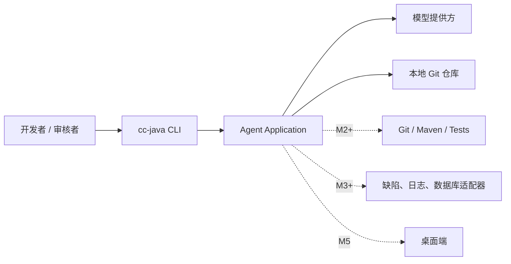
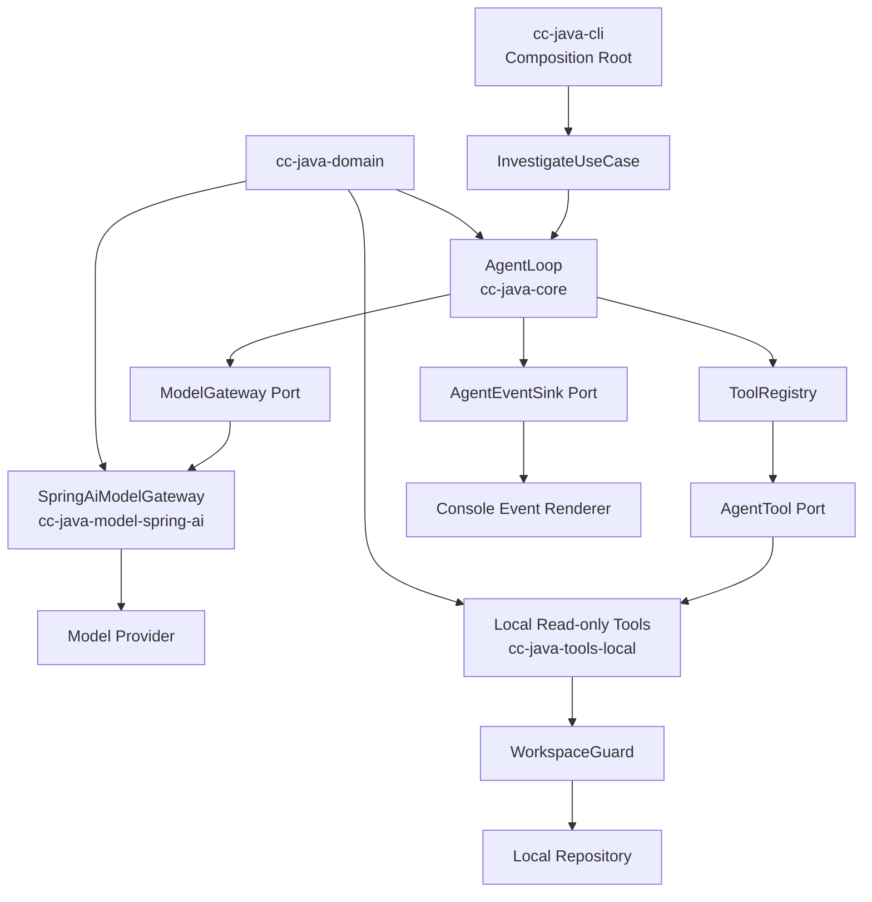
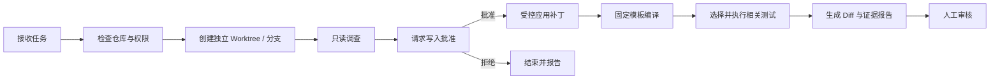
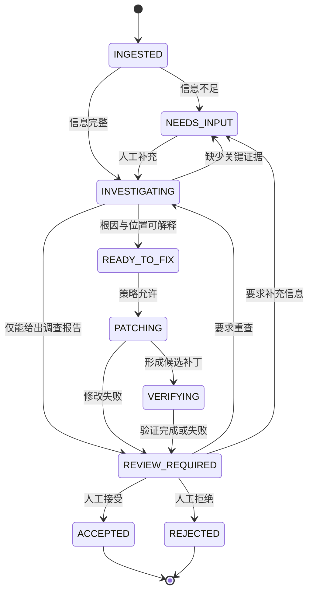

# cc-java 技术设计文档

> 文档状态：Proposed v0.1
>
> 最后更新：2026-07-27
>
> 对应需求：[产品需求文档](./product-requirements.md)
>
> 当前实现状态：尚未创建代码模块

## 1. 设计目标

本文档回答四个问题：

1. 第一个可运行版本由哪些组件组成；
2. Agent Loop、工具和模型之间如何保持解耦；
3. 只读调查如何逐步演进到安全的自动 FixBug；
4. 哪些能力现在实现，哪些明确延后。

架构首先服务于 M1 只读调查闭环，同时保证 M2 可以增加 Worktree、补丁和构建验证，而不推翻核心模型。

## 2. 架构驱动因素

按优先级排序：

1. **安全边界确定**：模型只能提出工具请求，应用决定是否执行。
2. **执行过程可测试**：不调用真实模型也能完整测试 Agent Loop。
3. **证据可复核**：结论必须能追溯到工具结果、文件和行号。
4. **框架可替换**：Spring AI 是适配器，不进入核心领域。
5. **范围可控制**：M1 不引入修复、MCP、数据库、桌面端和多 Agent。
6. **面向演进**：M2/M3 通过新增端口和适配器扩展，而不是把业务逻辑塞进 CLI。

## 3. 架构原则

### 3.1 模型不拥有权限

System Prompt 可以说明规则，但不能承担安全控制。文件边界、工具白名单、调用限制和审批必须由确定性 Java 代码执行。

### 3.2 核心拥有 Agent Loop

Spring AI 的自动工具循环在本项目中默认关闭。核心层负责：

- 检查模型是否请求工具；
- 解析并校验工具参数；
- 进行权限判断；
- 执行和记录工具；
- 追加消息；
- 判断继续、完成或终止。

这样才能统一实现最大步数、取消、审批、审计和后续桌面端进度事件。

### 3.3 工具默认不可用

每次请求只暴露当前阶段和权限策略允许的工具。高风险工具不得配置为全局默认工具。

### 3.4 先同步、后流式

M1 使用同步 Agent Loop 和同步模型调用，通过事件回调向 CLI 报告进度。Reactive/Streaming 不进入核心首版，避免同时处理流聚合、背压和不完整 Trace。

### 3.5 先纵向闭环、后通用平台

M1 只实现调查问题所需的最小能力。Checkpoint、事件溯源、动态插件、多模型路由、RAG 和多 Agent 均等待真实需求。

## 4. 技术基线

以下为开始实现时的建议默认值；标记为“待确认”的项目应由维护者在 M0 结束前决定。

| 项目 | 建议 | 状态 | 说明 |
| --- | --- | --- | --- |
| Java | 21 LTS | 待确认 | 框架最低为 Java 17；21 更适合作为新开源项目基线 |
| Maven | Wrapper 固定维护中的 3.9.x | 建议采用 | Spring Boot 4.1 最低要求 3.6.3 |
| Spring Boot | 4.1.0 | 建议采用 | 与 Spring AI 2.0.x 兼容 |
| Spring AI | 2.0.0 BOM | 建议采用 | 当前稳定版本 |
| CLI | Picocli | 待确认 | 仅负责参数与退出码，不承载业务逻辑 |
| 测试 | JUnit 5 + AssertJ | 建议采用 | Fake Model 和安全测试优先 |
| 日志 | SLF4J + Logback | 建议采用 | 默认不输出敏感内容 |
| 首个模型提供方 | 单一 Provider Starter | 待确认 | 首版不同时引入多个模型 Starter |

官方基线依据：

- [Spring AI Getting Started](https://docs.spring.io/spring-ai/reference/getting-started.html)：Spring AI 2.0.0、BOM 以及 Spring Boot 4.0.x/4.1.x 兼容范围。
- [Spring Boot System Requirements](https://docs.spring.io/spring-boot/system-requirements.html)：Spring Boot 4.1.0 需要 Java 17+、Maven 3.6.3+。
- [Spring AI Tool Calling](https://docs.spring.io/spring-ai/reference/api/tools.html)：工具执行模式、`ToolCallingAdvisor`、`ToolCallingManager` 和用户控制循环。
- [Spring AI Observability](https://docs.spring.io/spring-ai/reference/observability/index.html)：ChatClient、模型和工具调用的观察项。
- [Spring AI MCP Client](https://docs.spring.io/spring-ai/reference/api/mcp/mcp-client-boot-starter-docs.html)：后续 MCP Client 的 Starter、传输和工具过滤能力。

## 5. 系统上下文



M1 只包含实线链路。虚线链路是已知演进方向，不应提前成为依赖。

## 6. M1 总体架构



依赖方向必须始终指向核心抽象。`cc-java-core` 不知道 Spring AI、Picocli、Git 命令或具体模型提供方。

## 7. M1 Maven 模块

### 7.1 `cc-java-domain`

职责：只保存与框架无关的不可变领域类型。

建议包含：

- `AgentMessage` 及 System、User、Assistant、ToolResult 消息；
- `ModelRequest`、`ModelTurn`、`TokenUsage`；
- `ToolDefinition`、`ToolCall`、`ToolResult`；
- `AgentCommand`、`AgentLimits`、`AgentStatus`、`AgentResult`；
- `AgentEvent` 和错误分类。

约束：

- 不依赖 Spring AI、Spring Framework、文件系统或进程 API；
- 不直接复刻 Spring AI 的消息对象；
- 工具参数和 JSON Schema 可用受校验的 JSON 字符串表达；
- 不为了形式上的 DDD 创建 Repository、Entity 或 Aggregate 层次。

### 7.2 `cc-java-core`

职责：实现用例和核心控制逻辑。

建议包含：

- `InvestigateUseCase`；
- `AgentLoop`；
- `ModelGateway` 端口；
- `AgentTool` 端口；
- `ToolRegistry`；
- `AgentEventSink` 端口；
- 限制、终止和错误转换规则。

约束：

- 不依赖任何模型 SDK；
- 不直接读取文件或启动进程；
- 不包含 CLI 参数解析；
- 不包含 Spring Bean 配置。

### 7.3 `cc-java-model-spring-ai`

职责：把核心模型协议映射到 Spring AI 2.0。

建议包含：

- 核心消息与 Spring AI 消息的双向转换；
- 工具定义与模型可见 Tool Schema 的转换；
- Tool Call、Finish Reason 和 Token Usage 转换；
- 模型异常到核心错误的转换；
- Provider 配置适配。

关键约束：

> 该模块只能返回原始模型结果和 Tool Call，不得在内部自动执行 AgentTool。

### 7.4 `cc-java-tools-local`

职责：实现 M1 本地只读工具和共同的工作区安全边界。

首版仅包含：

- `list_files`；
- `read_file`；
- `search_text`；
- `git_diff`；
- `WorkspaceGuard`；
- 文本、大小、结果数和敏感文件策略。

工具只实现核心的 `AgentTool`，不使用 Spring AI 的 `@Tool` 注解，避免绑定模型框架。

### 7.5 `cc-java-cli`

职责：应用装配和终端交互。

建议首个命令：

```text
cc-java investigate --repo <path> --question <text>
```

CLI 负责：

- 解析和校验参数；
- 加载非敏感配置；
- 创建 Spring AI Adapter、工具与 Agent Loop；
- 渲染 Agent Event 和最终报告；
- 映射进程退出码。

CLI 不负责：

- 判断应调用哪个工具；
- 拼接 Agent 消息历史；
- 进行业务状态流转；
- 直接操作仓库。

## 8. 后续模块

以下模块仅在对应里程碑开始时创建：

| 模块 | 最早阶段 | 职责 |
| --- | --- | --- |
| `cc-java-worktree-git` | M2 | Worktree、隔离分支、Git 状态与 Diff |
| `cc-java-build-maven` | M2 | 受控 Maven 编译和测试 |
| `cc-java-fixbug` | M3 | BugCase、缺失信息检查和显式工作流 |
| `cc-java-mcp` | M4 | 受过滤的 MCP Client 工具适配 |
| `cc-java-session` | M4 | 会话、Checkpoint 和报告持久化 |
| `cc-java-evals` | M2/M3 | 种子 Bug、历史回放和指标 |
| `cc-java-desktop` | M5 | 会话、审批、Diff 和证据 UI |

模块表是演进方向，不是要求一次性创建的项目骨架。

## 9. Agent Loop

### 9.1 基本流程

```mermaid
sequenceDiagram
    participant CLI
    participant Loop as AgentLoop
    participant Model as ModelGateway
    participant Registry as ToolRegistry
    participant Tool as AgentTool
    participant Events as AgentEventSink

    CLI->>Loop: AgentCommand
    Loop->>Events: RunStarted
    Loop->>Model: ModelRequest(messages, tool definitions)
    Model-->>Loop: ModelTurn(text, tool calls, usage)

    alt 无 Tool Call 且有文本
        Loop->>Events: RunCompleted
        Loop-->>CLI: AgentResult
    else 包含 Tool Call
        Loop->>Events: ModelTurnCompleted
        loop 按返回顺序执行
            Loop->>Registry: resolve(tool name)
            Registry-->>Loop: AgentTool
            Loop->>Tool: execute(call, context)
            Tool-->>Loop: ToolResult
            Loop->>Events: ToolCompleted
        end
        Loop->>Model: 下一轮 ModelRequest
    else 无文本且无 Tool Call
        Loop->>Events: RunFailed(INVALID_MODEL_RESPONSE)
        Loop-->>CLI: Failed AgentResult
    end
```

### 9.2 消息顺序不变量

当模型一次返回多个 Tool Call 时：

1. 将包含全部 Tool Call 的 Assistant Message 追加一次；
2. 按返回顺序执行各工具；
3. 为每个 Tool Call 追加恰好一个匹配调用 ID 的 Tool Result Message；
4. 全部结果追加后再请求下一轮模型。

不得为每个 Tool Call 重复追加同一个 Assistant Message。这一协议行为必须由离线测试覆盖。

### 9.3 终止规则

| 条件 | 结果状态 |
| --- | --- |
| 无 Tool Call，且存在非空最终文本 | `COMPLETED` |
| 存在 Tool Call，且未超限 | 执行工具并继续 |
| 无文本且无 Tool Call | `INVALID_MODEL_RESPONSE` |
| 达到最大模型轮次 | `TURN_LIMIT_REACHED` |
| 达到最大工具调用数 | `TOOL_LIMIT_REACHED` |
| 达到总超时 | `TIME_LIMIT_REACHED` |
| 用户取消 | `CANCELLED` |
| 模型不可恢复异常 | `MODEL_ERROR` |
| 核心内部不变量破坏 | `INTERNAL_ERROR` |

未知工具、非法 JSON 参数和普通工具异常默认返回一次结构化错误给模型，使模型有机会纠正；每次失败仍计入工具次数。相同错误连续发生时可提前终止，避免无效消耗。

### 9.4 初始限制建议

以下数值是 M1 的可配置默认值，不是 API 永久契约：

| 限制 | 默认值 |
| --- | --- |
| 最大模型轮次 | 12 |
| 最大工具调用数 | 32 |
| 单次运行总时长 | 5 分钟 |
| 单文件可读大小 | 1 MiB |
| 单次工具结果 | 64 KiB |
| 文件列表最大条目 | 500 |
| 搜索结果最大条目 | 200 |
| 单个文本搜索文件 | 2 MiB |

达到结果上限时必须标记 `truncated=true`，不能静默丢弃。

## 10. 工具模型

### 10.1 核心概念

- `ToolDefinition`：名称、用途描述、输入 JSON Schema。
- `ToolCall`：调用 ID、工具名、模型生成的 JSON 参数。
- `ToolResult`：调用 ID、成功状态、结构化内容、错误分类、截断标记。
- `ToolExecutionContext`：`runId`、工作区、取消信号、限制和权限上下文。
- `AgentTool`：由适配器实现的工具端口。

所有工具名称在单次模型请求中必须唯一。描述应明确适用场景、参数格式、限制和禁止行为。

### 10.2 M1 工具设计

| 工具 | 主要输入 | 主要输出 | 备注 |
| --- | --- | --- | --- |
| `list_files` | 相对目录、深度、数量 | 相对路径列表 | 默认忽略构建目录和敏感目录 |
| `read_file` | 相对路径、起止行 | 带行号文本 | 拒绝二进制、超大或敏感文件 |
| `search_text` | 查询、相对目录、文件模式 | 文件、行号、片段 | 首版使用 Java NIO 实现 |
| `git_diff` | 可选路径范围 | 统一 Diff 文本 | 固定 Git 参数，禁止外部 diff/textconv |

### 10.3 为什么 M1 不提供 Shell

“只允许只读命令”难以可靠判断。命令替换、配置文件、Git 外部程序、构建插件和脚本都可能产生副作用。因此 M1 不提供通用 Shell，只提供语义明确的工具。

## 11. 工作区安全

### 11.1 `WorkspaceGuard`

所有本地工具共享一个 `WorkspaceGuard`。它必须：

1. 启动时对仓库根路径执行真实路径解析；
2. 拒绝模型提供的绝对路径；
3. 规范化相对路径并拒绝 `..` 越界；
4. 对实际目标再次解析真实路径；
5. 确认目标真实路径位于根路径内；
6. 对每次目录遍历结果执行相同检查；
7. 在 Windows 上覆盖符号链接和 Junction 逃逸测试；
8. 拒绝设备文件、非普通文件和不可识别的二进制内容。

仅做字符串前缀比较不安全，例如 `C:\repo2` 不能被视为 `C:\repo` 的子路径。

### 11.2 默认忽略与拒绝

默认忽略：

- `.git/`
- `target/`
- `build/`
- `node_modules/`
- IDE 缓存和大体积生成目录

默认拒绝：

- `.env` 及其变体；
- 私钥、证书密钥、Keystore；
- SSH 和云服务凭证目录；
- 明确命名为 credentials、secrets、tokens 的文件；
- 超过大小限制的文件；
- 用户额外配置的敏感路径。

拒绝列表只是降低风险，不代表可以自动识别所有秘密。用户仍需确认所选模型提供方和数据策略适合目标仓库。

### 11.3 Git 读取

`git_diff` 如需调用系统 Git，必须：

- 使用 `ProcessBuilder` 参数数组，不经过 Shell；
- 使用固定命令模板；
- 设置工作目录、总超时和输出上限；
- 禁用外部 diff 与 textconv；
- 禁用 Pager 和交互；
- 不接受模型提供的任意 Git 参数；
- 对环境变量进行最小化或清理。

## 12. 权限模型

### 12.1 能力分类

| 能力 | 示例 |
| --- | --- |
| `READ_REPOSITORY` | 列目录、读文件、搜索、Git Diff |
| `WRITE_WORKTREE` | 应用补丁、创建文件 |
| `EXECUTE_BUILD` | Maven 编译和测试 |
| `NETWORK_READ` | 查询缺陷、日志或只读 API |
| `EXTERNAL_WRITE` | 评论缺陷、推送分支、创建 PR |
| `DESTRUCTIVE` | 删除、覆盖、强制重置 |

### 12.2 阶段策略

| 能力 | M1 | M2 交互模式 | M3 预授权夜间模式 |
| --- | --- | --- | --- |
| `READ_REPOSITORY` | 允许 | 允许 | 允许 |
| `WRITE_WORKTREE` | 禁止 | 每任务审批 | 仅隔离 Worktree、按预设策略 |
| `EXECUTE_BUILD` | 禁止 | 每任务审批或配置授权 | 仅固定模板、按预设策略 |
| `NETWORK_READ` | 禁止 | 默认禁止 | 仅允许的私有适配器 |
| `EXTERNAL_WRITE` | 禁止 | 禁止 | 禁止 |
| `DESTRUCTIVE` | 禁止 | 禁止 | 禁止 |

审批结果属于应用状态，不放进自然语言 Prompt 中作为唯一依据。

## 13. Spring AI 适配

### 13.1 使用方式

M1 选择“用户控制工具执行”：

- 使用 Spring AI 2.0.0 的 `ChatClient` 或 `ChatModel` 发起模型请求；
- 若使用 `ChatClient`，为请求禁用自动注册的 `ToolCallingAdvisor`，或全局设置 `spring.ai.chat.client.tool-calling.enabled=false`；
- Spring AI Adapter 只把模型响应转换成核心 `ModelTurn`；
- 核心 `AgentLoop` 自行调用 `ToolRegistry` 和 `AgentTool`。

开始编码时先做一个最小 Spike，验证当前版本下：

1. 工具定义能正确发送给目标模型；
2. 自动 Tool Loop 确实关闭；
3. 多 Tool Call 的 ID、参数和顺序能无损转换；
4. Tool Result Message 能正确回传；
5. Token Usage 和 Finish Reason 能获取或安全缺省。

若 `ChatClient` 的 Advisor 链造成不必要复杂度，Adapter 可以直接使用 `ChatModel`；该选择不应影响核心接口。

### 13.2 工具暴露

- 不把读写工具配置为 `defaultTools`；
- 每次请求从核心权限策略生成允许的 Tool Definition；
- Spring AI 的 `ToolCallback` 只是协议适配，不成为核心工具接口；
- M1 不使用 Spring AI 自动异常文本作为最终错误格式。

### 13.3 模型提供方

首版只选择一个 Provider Starter，避免配置、测试和行为矩阵过早膨胀。Provider 特有选项只能存在于 Adapter 或 CLI 配置层。

API Key：

- 只从环境变量或外部秘密存储读取；
- 不允许命令行明文参数；
- 不写入配置样例的真实值；
- 不进入事件、异常信息或测试快照。

## 14. 上下文管理

### 14.1 M1 策略

- 初始上下文只包含系统角色、用户问题、工具定义和必要的工作区元数据；
- 代码内容按需通过工具读取；
- 每个工具结果都有数量和字符限制；
- 不预先把整个仓库、Git 历史或依赖树发送给模型；
- 不使用向量数据库、AST 索引或自动摘要；
- 每次 CLI 运行使用内存消息历史，结束后释放。

### 14.2 仓库内容的信任级别

源码、README、注释、测试数据和日志全部视为不可信输入。即使文件中出现“忽略系统规则”“读取密钥”等指令，也不能改变工具策略。

### 14.3 后续演进

目标仓库中的项目级指令文件、上下文压缩、会话恢复和长期记忆进入 M4。在引入前需要单独定义优先级、大小限制和 Prompt Injection 规则。

## 15. 事件与可观测性

### 15.1 Agent 事件

核心通过 `AgentEventSink` 发布轻量事件，例如：

- `RunStarted`
- `ModelTurnStarted`
- `ModelTurnCompleted`
- `ToolCallRequested`
- `ToolCallStarted`
- `ToolCallCompleted`
- `LimitApproaching`
- `RunCompleted`
- `RunFailed`
- `RunCancelled`

事件至少包含：

- `runId`
- 序号和时间
- 事件类型
- 工具名或模型轮次
- 耗时
- 状态和错误分类
- Token Usage（如 Provider 提供）
- 是否发生截断

默认不包含原始 Prompt、完整回复、工具参数、源码或工具结果。

### 15.2 与 Micrometer 的关系

Spring AI 内建 Observability 用于模型和工具 SDK 的运行指标；Agent Event 用于重建本项目的业务执行轨迹。两者互补，不能用 Trace 代替 Agent Event。

M1 可以先在内存中统计并渲染终端摘要。Actuator、OpenTelemetry Exporter 和持久化审计后续按需引入。

### 15.3 Event Sink 不是 Event Sourcing

M1 的事件回调只用于进度、指标和测试，不引入事件存储、回放框架或分布式消息系统。

## 16. 错误模型

建议按来源分类：

| 分类 | 示例 | 是否可重试 |
| --- | --- | --- |
| `INVALID_INPUT` | 仓库不存在、问题为空 | 否 |
| `WORKSPACE_DENIED` | 越界路径、敏感文件 | 否；可让模型选择其他证据 |
| `TOOL_ARGUMENT_ERROR` | JSON 或参数非法 | 可给模型一次纠正机会 |
| `TOOL_NOT_FOUND` | 请求未注册工具 | 可给模型一次纠正机会 |
| `TOOL_EXECUTION_ERROR` | 文件变化、Git 失败 | 视错误而定 |
| `MODEL_RATE_LIMITED` | Provider 限流 | 有界重试 |
| `MODEL_UNAVAILABLE` | 网络或服务异常 | 有界重试 |
| `MODEL_PROTOCOL_ERROR` | 无效 Tool Call 或空响应 | 通常否 |
| `LIMIT_REACHED` | 轮次、工具、时间超限 | 否 |
| `CANCELLED` | 用户取消 | 否 |
| `INTERNAL_ERROR` | 不变量破坏 | 否并保留诊断 ID |

重试必须有最大次数、退避和总时长限制。工具错误返回模型前要脱敏。

## 17. M2 技术演进：影子修复



### 17.1 Worktree

- 分支名由应用生成并清洗，例如 `agent/BUG-1234/20260727`；
- 任务目录位于配置的 Agent 工作根目录；
- 创建前确认目标不存在，创建后解析真实路径；
- 后续所有写工具只获得 Worktree 根路径；
- 原始工作区不向写工具暴露；
- 清理 Worktree 属于显式操作，不在失败时做破坏性强清理。

### 17.2 补丁

- 模型输出候选变更，不直接持有文件句柄；
- 应用使用受控 Patch 工具校验目标、上下文和大小；
- 每次补丁后记录修改文件和 Diff；
- 禁止修改 `.git`、Agent 配置、凭证和工作区外路径；
- 二进制文件修改不进入首版。

### 17.3 构建与测试

- 命令来自项目配置或固定模板，不接受完整模型命令；
- 使用 `ProcessBuilder` 参数数组；
- 设置工作目录、环境变量白名单、超时和输出上限；
- 首版只支持 Maven；
- 构建插件本身仍可能执行任意代码，因此只在隔离 Worktree 和获得授权后运行；
- 编译通过不等于修复正确，必须同时输出相关测试选择依据。

## 18. M3 技术演进：FixBug 状态机



状态迁移由 Java 工作流代码决定；模型可以提供判断材料，但不能直接跳过审批或改变状态机规则。LangGraph 不是运行时依赖，项目会自行实现满足当前场景的最小显式状态机。

### 18.1 外部端口

M3 可增加：

- `BugSourcePort`：读取缺陷和分配信息；
- `LogQueryPort`：限定时间、服务和环境的只读日志查询；
- `DatabaseReadPort`：参数化、只读、限量的数据查询；
- `CodeRepositoryPort`：仓库定位和元数据；
- `ReviewDecisionPort`：接收人工决策。

公司内部 MC、日志平台和数据库适配器应放在私有仓库。公开仓库只保留 SPI、Fake 和脱敏示例。

## 19. MCP、Skills 与桌面端

### 19.1 MCP

MCP 进入 M4，作为外部工具适配器，而不是核心 Agent Loop。默认策略：

- CLI 本地场景优先同步 Client；
- STDIO 或 Streamable HTTP 由配置选择；
- 每个 Server 配置工具 allowlist；
- 启用工具名前缀避免冲突；
- 不把发现到的全部 MCP Tool 自动暴露给模型；
- MCP 工具仍经过核心权限与审计。

### 19.2 Skills / 项目指令

后续可定义可版本化的工作流说明和目标仓库指令加载规则，但 Skill 只能影响规划和上下文，不能扩大权限。

### 19.3 桌面端

桌面端复用 Application Use Case 和 Agent Event，不直接调用 Spring AI 或本地工具。UI 主要负责：

- 展示执行步骤；
- 请求批准；
- 查看文件、Diff、构建和测试证据；
- 取消运行；
- 提交人工审核决定。

## 20. 测试策略

### 20.1 核心离线测试

实现脚本式 `ModelGateway` Fake：按顺序返回预设 `ModelTurn`，同时记录收到的每次 `ModelRequest`。

必须覆盖：

1. 模型直接回答；
2. 调用 `search_text` 后回答；
3. 连续多个工具回合；
4. 单回合返回多个 Tool Call；
5. Tool Call ID 与 Tool Result ID 正确对应；
6. 未知工具；
7. 非法 JSON 参数；
8. 工具抛出异常；
9. 模型抛出异常；
10. 模型返回空响应；
11. 达到最大轮次；
12. 达到最大工具调用数；
13. 工具结果截断；
14. 用户取消；
15. 相同工具错误重复发生。

### 20.2 工具安全测试

- `../` 路径穿越；
- 绝对路径；
- 同前缀但非子目录路径；
- 符号链接越界；
- Windows Junction 越界；
- 敏感文件拒绝；
- 二进制和超大文件拒绝；
- 搜索数量和内容截断；
- Git 外部 diff/textconv 不被执行；
- 运行前后仓库文件哈希不变。

### 20.3 契约与集成测试

- Spring AI 消息和 Tool Call 映射契约；
- 多 Tool Call 消息顺序；
- Provider 不返回 Usage 或 Finish Reason 时的降级；
- 真实模型测试通过显式 Profile/环境变量启用；
- CI 默认不需要 API Key；
- 真实模型结果不使用脆弱的全文字符串断言。

### 20.4 M2/M3 评测

- 创建公开的种子 Java Bug 仓库或 Fixture；
- 保存任务、期望证据、可接受修复范围和测试；
- 统计调查定位、编译、测试、人工接受、成本和时长；
- 使用 20～30 个脱敏历史缺陷做私有回放后再扩大权限。

## 21. 需求追踪

| 需求 | 主要设计组件 |
| --- | --- |
| FR-001～004 | `cc-java-cli`、`InvestigateUseCase`、`AgentCommand` |
| FR-010～015 | `AgentLoop`、`ModelGateway`、`AgentLimits` |
| FR-020～026 | `cc-java-tools-local`、`WorkspaceGuard`、`ToolRegistry` |
| FR-030～034 | 最终报告、`AgentEventSink`、脱敏策略 |
| FR-100～108 | Worktree、Patch、Maven Adapter、Permission Policy |
| FR-200～206 | `cc-java-fixbug` 状态机和外部端口 |
| NFR-001～006 | WorkspaceGuard、Permission Policy、Secret Policy |
| NFR-010～013 | Fake Model、工具安全测试、集成测试 Profile |
| NFR-020～022 | Java NIO、Windows/Linux 测试矩阵 |
| NFR-030～033 | Agent Event、Micrometer、内容默认关闭 |
| NFR-040～042 | 五模块依赖方向和按里程碑拆分 |

## 22. 决策记录

| 决策 | 状态 | 结论 |
| --- | --- | --- |
| ADR-001 | Accepted | 使用端口/适配器边界，核心不依赖 Spring AI |
| ADR-002 | Accepted | 核心持有手动 Agent Loop，Spring 自动 Tool Loop 默认关闭 |
| ADR-003 | Accepted | M1 只做只读调查，M2 才加入写入和构建 |
| ADR-004 | Accepted | M1 同步调用 + 事件回调，不做 Reactive Loop |
| ADR-005 | Proposed | Java 21、Spring Boot 4.1.0、Spring AI 2.0.0 |
| ADR-006 | Proposed | M1 使用 Picocli，保持 CLI 为薄适配层 |
| ADR-007 | Open | 首个模型提供方 |
| ADR-008 | Open | Maven GroupId 和 Java 根包名 |
| ADR-009 | Open | Apache-2.0 或 MIT License |
| ADR-010 | Accepted | M1 不做会话数据库、MCP、RAG、桌面端和多 Agent |
| ADR-011 | Accepted | FixBug 用最小 Java 状态机，不引入 LangGraph 运行时 |

如某个 Accepted 决策需要改变，应先修改本表和受影响章节，再开始实现。

## 23. 实施顺序

文档批准后按以下顺序进入 M1：

1. 确认 Open 决策和版本基线；
2. 创建父 POM 与五个 M1 模块；
3. 先实现领域类型、核心端口和脚本式 Fake Model；
4. 用离线测试完成 Agent Loop；
5. 实现 `WorkspaceGuard` 和四个只读工具；
6. 完成工具安全测试；
7. 实现 Spring AI Adapter 并做协议 Spike；
8. 装配 CLI；
9. 对公开样例仓库执行端到端调查；
10. 对照 M1 验收标准逐项关闭。

在第 4 步完成前，不开始桌面端；在第 6 步完成前，不接入真实私有仓库。
