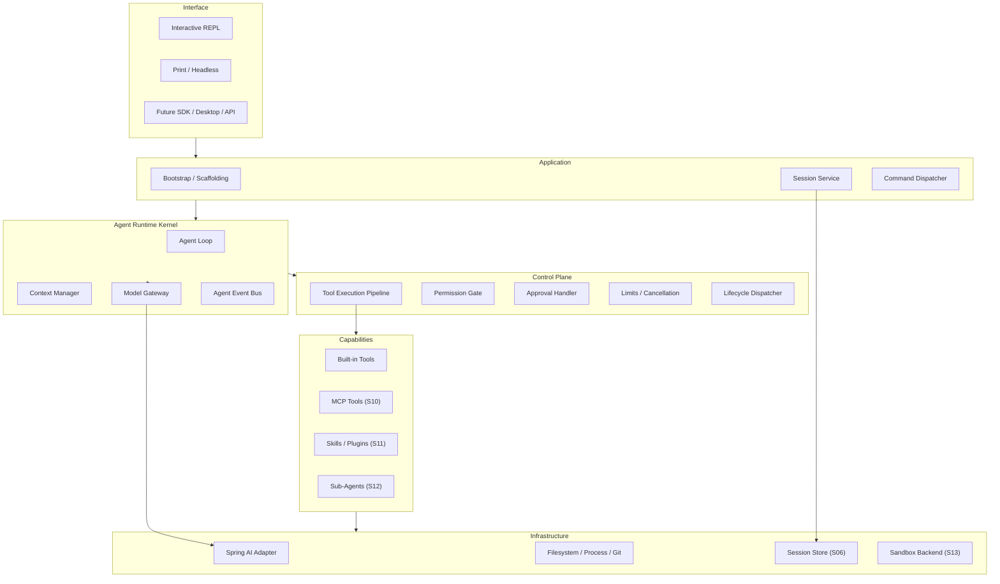
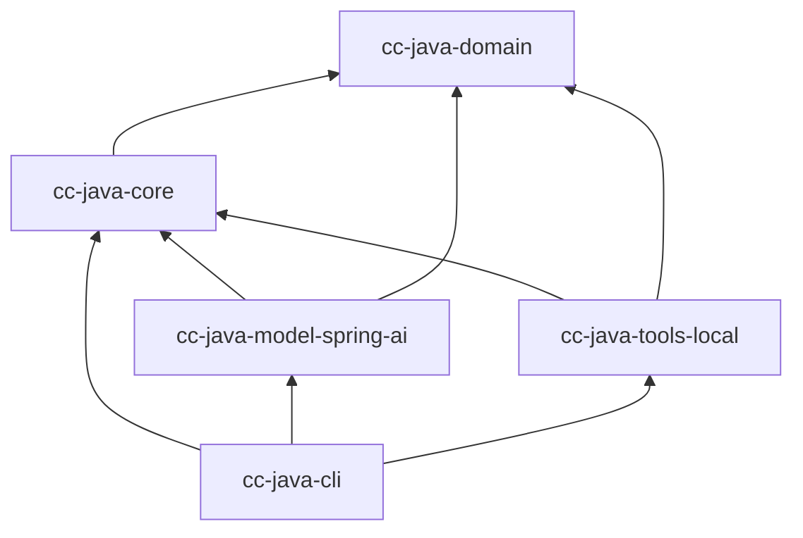
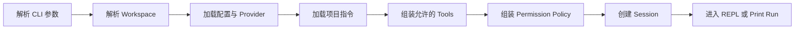
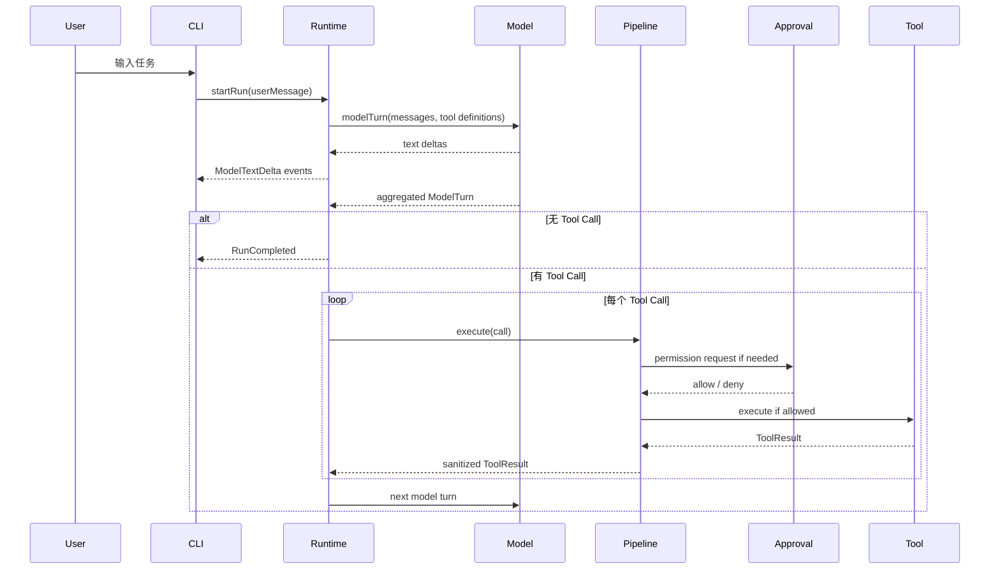
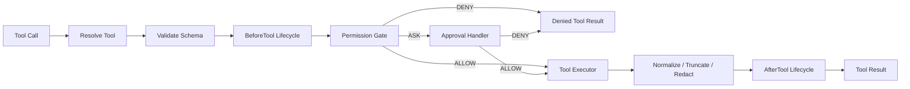

# cc-java 技术设计文档

> 文档状态：Proposed v0.4
>
> 最后更新：2026-07-28
>
> 对应需求：[产品需求文档](./product-requirements.md)
>
> 当前学习阶段：S01 Runtime Kernel
>
> 当前实现状态：离线 Agent Loop 已实现；真实模型和 CLI 尚未开始
>
> 阶段与能力权威：[功能对照矩阵](./feature-parity-matrix.md)

## 1. 设计目标

`cc-java` 的技术目标是从零实现一个 Java 原生、可嵌入、可测试的 Coding Agent Runtime，并首先通过终端 CLI 交付。

项目采用“参考建模 → Java 独立重实现 → 黑盒行为对照 → 差距复盘 → 独立创新”的学习路径。技术实现不是围绕一次性 MVP 自由生长，而是按 S00～S15 逐步理解和重建成熟 Coding Agent Harness 的公开能力。

核心架构必须能够支撑：

- 交互式和非交互式运行；
- 模型流式输出与 Tool Calling；
- 文件读取、搜索、修改和命令执行；
- 权限、审批、取消、限制和生命周期事件；
- 会话、上下文、Hooks、Skills、MCP 和 Sub-Agent 的渐进演进。

FixBug 不出现在 Runtime 架构中。它未来只能作为一组 Prompt、Skill、Tool 或上层 Application 使用通用 Runtime。

S01～S04 会逐步形成第一个可运行的 Mini Coding Agent CLI。它只是验证 Runtime、Model、Tool 和终端边界的阶段检查点，不是功能终点，也不表示已达到参考产品对等。后续仍须按矩阵完成 Permission、Session、Context、Hooks、MCP、Skills、Sub-Agent、Sandbox 和 Production Harness。

## 2. 参考方法与 clean-room 边界

设计输入来自：

1. 本项目自己的产品需求和验收任务；
2. Spring AI 官方公开 API；
3. Claude Code 等成熟 CLI 的公开文档和可观察行为；
4. Harness Engineering 的通用架构分析。

设计不使用以下输入：

- 泄露源码的具体实现；
- 受限制源码中的函数体、类型名、注释、Prompt、错误文案和文件结构；
- 商业产品内部 Session、Hook 或配置格式；
- 无法确认许可证的代码片段。

本项目借鉴的是“显式 Agent Loop、统一 Tool Pipeline、纵深权限、上下文压力、可恢复会话和扩展层”等架构原则，而不是进行 Java 翻译。

详细映射见 [参考架构研究](./reference-architecture.md)。

### 2.1 阶段权威与完成证据

[功能对照矩阵](./feature-parity-matrix.md) 是以下内容的唯一权威：

- S00～S15 的主题、顺序和完成定义；
- 每项 Capability ID 所属 Stage；
- L0～L4 完成度及行为对照状态；
- 当前差距和下一项学习能力。

本文负责解释这些能力在 Java 中如何分层、如何保持依赖方向以及如何实现安全边界。若本文中的阶段归属与矩阵冲突，应先以矩阵为准，再在同一变更中修正本文。

每个 Stage 结束前必须同时交付：

1. 更新功能对照矩阵中的等级、行为测试和证据链接；
2. 更新相关设计说明，并新增或修订 ADR；
3. 提供与本 Stage 对应的离线测试和可运行 Demo；
4. 提交差距报告，说明参考实现仍然更强之处、当前 Java 实现的限制和下一步能力。

只完成代码、只跑通 Demo 或只更新矩阵，都不构成 Stage 完成。

## 3. 架构原则

### 3.1 Runtime 是产品核心

CLI、未来桌面端和 SDK 都只是 Runtime 的 Client。Agent Loop、工具执行、权限和 Session 不能写进终端代码。

### 3.2 模型只产生意图

模型可以请求工具，但不能直接访问文件、进程、网络或权限配置。应用代码负责决定：

- 请求是否合法；
- 当前模式是否允许；
- 是否需要人工审批；
- 应如何执行；
- 结果如何裁剪和回传。

### 3.3 所有工具经过同一 Pipeline

内置 Tool、未来 MCP Tool、Plugin Tool 和 Sub-Agent Tool 必须进入同一个 Tool Execution Pipeline。任何绕过 Pipeline 的执行入口都会破坏权限、Hooks、事件和审计。

### 3.4 流式观察，顺序控制

S01 建立顺序 Agent Loop；S02 接入流式模型与终端事件。模型文本、工具输出和状态通过事件增量发给终端，但首轮重实现不把 Reactor 类型泄漏到核心。安全读工具的有界并行延后到 S12，写工具始终默认顺序执行。

### 3.5 状态显式，终止有限

当前消息、回合数、工具次数、Token、运行时间、权限模式和取消状态都在显式 Run State 中。每条循环路径都有 Stop Reason。

### 3.6 先建立可运行检查点，再持续补齐 Harness

S01～S04 依次完成 Loop、真实模型与 CLI、只读工具、写入与命令，形成真实的“读 → 改 → 跑 → 验证”检查点；S05 再系统完成 Permission Pipeline。此检查点用于验证架构和学习成果，不改变 S06～S15 的既定路线，也不提前实现 Hooks、MCP、Sub-Agent、Sandbox 或插件系统。

## 4. 技术基线

| 项目 | 建议 | 状态 |
| --- | --- | --- |
| Java | 21 | Accepted（S01） |
| Maven | Wrapper 3.3.4 → Maven 3.9.16 | Accepted（S01） |
| GroupId / 根包 | `io.github.liumaishenjian` / `io.github.liumaishenjian.ccjava` | Accepted（S01） |
| Test | JUnit 5.14.3 + AssertJ 3.27.7 | Accepted（S01） |
| Spring Boot | 在 S02 按真实用途确认 | Deferred |
| Spring AI | 在 S02 按 Provider Spike 确认 | Deferred |
| CLI Parser | Picocli 候选 | Proposed（S02） |
| Interactive Terminal | JLine 候选 | Proposed（S02） |
| 首个 Provider | 单一 Spring AI Model Starter | Open（S02） |

S01 不引入 Spring Boot、Spring AI、Picocli 或 JLine。框架准确版本必须在 S02
通过真实 Provider 与流式 Tool Call Spike 决定，不能仅为占位锁定依赖。

参考：

- [Spring AI Getting Started](https://docs.spring.io/spring-ai/reference/getting-started.html)
- [Spring AI Tool Calling](https://docs.spring.io/spring-ai/reference/api/tools.html)
- [Spring Boot System Requirements](https://docs.spring.io/spring-boot/system-requirements.html)

## 5. 逻辑分层



## 6. S01 起步的 Maven 模块

S01 只创建五个模块，后续 Stage 在这组稳定边界上渐进实现能力。S06 以后只有在矩阵明确需要新的基础设施 Adapter 时才增加模块，不为未来能力提前创建空壳。

```text
cc-java-domain
cc-java-core
cc-java-model-spring-ai
cc-java-tools-local
cc-java-cli
```

S01 只有 `cc-java-domain` 和 `cc-java-core` 包含 Runtime 实现；
`model-spring-ai`、`tools-local` 和 `cli` 目前只固定模块依赖方向与包边界，
不包含 Spring AI、文件 Tool 或终端实现，也不因此提升对应矩阵能力。

依赖方向：



### 6.1 `cc-java-domain`

保存框架无关的协议和值对象：

- `SessionId`、`RunId`；
- `AgentMessage`；
- `ModelRequest`、`ModelTurn`、`ModelUsage`；
- `ToolDefinition`、`ToolCall`、`ToolResult`；
- `ToolEffect`、`ToolSource`；
- `PermissionMode`、`PermissionDecision`；
- `AgentLimits`、`RunStatus`、`StopReason`；
- `AgentEvent`、`LifecycleEvent`。

约束：

- 不依赖 Spring、Reactor、文件系统、终端或 JSON SDK 类型；
- 类型不可变；
- 不复制 Spring AI 消息对象；
- 不包含 FixBug、BugCase 或电商业务概念。

### 6.2 `cc-java-core`

实现 Runtime 与端口：

- `AgentRuntime` / `AgentLoop`；
- `ModelGateway`；
- `ContextManager`；
- `ToolRegistry`；
- `ToolExecutionPipeline`；
- `AgentTool`；
- `PermissionGate`；
- `ApprovalHandler`；
- `LifecycleDispatcher`；
- `SessionStore` Port 和内存实现；
- `AgentEventSink`；
- `CancellationToken`；
- 限额、错误和 Stop Reason。

核心不得：

- 直接使用 Spring AI；
- 直接读写文件；
- 启动进程；
- 从终端读取输入；
- 打印 ANSI；
- 写 JSONL 文件。

### 6.3 `cc-java-model-spring-ai`

只负责模型协议适配：

- 核心消息与 Spring AI 消息转换；
- Tool Definition 转模型 Tool Schema；
- 流式文本增量转换成 Model Event；
- 聚合 Tool Call；
- Usage、Finish Reason 和异常转换；
- Provider 配置装配。

关键约束：

> Spring AI Adapter 不执行 AgentTool，也不拥有 Agent Loop。

### 6.4 `cc-java-tools-local`

实现本地能力：

- `WorkspaceGuard`；
- S03：`list_files`、`read_file`、`search_text`、`git_status`、`git_diff`；
- S04：`apply_patch`、`write_file`、`run_command`；
- 路径、进程、输出和错误适配。

本模块只实现核心 `AgentTool`，不使用 Spring AI `@Tool` 作为业务接口。

### 6.5 `cc-java-cli`

作为 Composition Root：

- S02 的 Picocli 参数和 JLine REPL；
- Spring Boot 启动和 Bean 装配；
- Workspace 与 Provider 配置；
- S04～S05 的 Approval Handler 终端实现；
- Agent Event 终端渲染；
- `Ctrl+C` 和进程退出码；
- Interactive / Print 模式。

CLI 不做模型决策、权限判断或 Tool Call 消息拼接。

## 7. 核心运行模型

### 7.1 Session、Run 与 Turn

- **Session**：从 CLI 启动到退出的一段连续对话。
- **Run**：一条用户消息触发的一次 Agent 执行。
- **Model Turn**：一次模型请求和聚合响应。
- **Tool Call**：模型在某个 Turn 中提出的一个环境操作。

一个 Session 包含多个 Run；一个 Run 包含多个 Model Turn 和 Tool Call。

### 7.2 Run State

S01 建立以下显式状态骨架，并由后续 Stage 补充持久化、Token 预算和恢复语义：

- Session ID、Run ID；
- 当前消息历史；
- Workspace；
- Permission Mode；
- 当前可见 Tool Set；
- Model Turn 计数；
- Tool Call 计数；
- 累计 Usage；
- 开始时间和 Deadline；
- 当前 Cancellation Token；
- 最近错误和 Stop Reason；
- Context 使用估计。

Run State 不使用全局静态变量。

## 8. Bootstrap / Scaffolding

每次启动 Session 时执行一次：



Bootstrap 只组装依赖和初始上下文，不驱动 Tool Loop。

S02 配置来源只有：

1. CLI 参数；
2. 环境变量；
3. 代码默认值。

用户、项目、本地和 Session 配置文件在 S08 统一实现，避免在 CLI 起步阶段先设计复杂优先级。

## 9. Agent Loop

### 9.1 外层会话与内层运行

```text
Session Loop:
  等待用户输入
  → 创建 Run
  → 执行 Agent Loop
  → 展示最终结果
  → 等待下一条输入

Agent Loop:
  组装当前 Context
  → 请求一个 Model Turn
  → 流式发布文本
  → 聚合 Model Turn
  → 无 Tool Call：完成
  → 有 Tool Call：逐个进入 Tool Pipeline
  → 追加 Tool Results
  → 下一 Model Turn
```

### 9.2 时序



### 9.3 多 Tool Call 协议

模型一次返回多个 Tool Call 时：

1. Assistant Message 连同全部 Tool Call 追加一次；
2. S01 按模型顺序执行；
3. 每个调用追加一个相同 Call ID 的 Tool Result；
4. 全部完成后再发起下一 Model Turn。

安全读工具的有界并行属于 S12。写工具、命令和相互依赖的 Tool Call 默认保持顺序。

### 9.4 流式设计

S02 提供终端流式体验，但核心不依赖 Reactor。

建议端口语义：

- `ModelGateway` 从调用者角度执行一个完整 Model Turn；
- Adapter 在调用期间通过 Observer/Event Sink 发布文本增量；
- 返回值是已聚合的 Model Turn，包含完整 Tool Call；
- Agent Loop 仍是普通顺序控制流；
- Spring AI Adapter 内部可以消费 `Flux`，但不得将 `Flux` 暴露到 domain/core。

Tool Call 可能跨多个流式 Chunk，必须聚合后才能进入 Pipeline。

### 9.5 Stop Reason

以下 Stop Reason 随 S01～S07 按矩阵逐步启用；领域协议先保持可扩展，不能把尚未实现的状态宣传为当前能力：

| Stop Reason | 含义 |
| --- | --- |
| `COMPLETED` | 模型给出最终回复 |
| `USER_CANCELLED` | 用户取消当前 Run |
| `MODEL_ERROR` | Provider 调用失败 |
| `INVALID_MODEL_RESPONSE` | 无文本且无有效 Tool Call |
| `TURN_LIMIT_REACHED` | 达到模型回合上限 |
| `TOOL_LIMIT_REACHED` | 达到 Tool Call 上限 |
| `TIME_LIMIT_REACHED` | 达到 Run Deadline |
| `CONTEXT_LIMIT_REACHED` | 无安全压缩能力且上下文不足 |
| `PERMISSION_DENIED` | 关键操作被拒绝后无法继续 |
| `TOOL_ERROR` | 不可恢复工具错误 |
| `INTERNAL_ERROR` | Runtime 不变量破坏 |

所有错误恢复都有次数和总时间限制。

## 10. Spring AI 适配

Spring AI 2.0 支持 Framework-Controlled、Advisor-Controlled 和 User-Controlled Tool Execution。本项目选择 User-Controlled。

本节对应 S02。S01 只使用 Scripted Fake `ModelGateway`，在离线协议测试完成前不接真实 Provider。

实现要求：

- 如果使用 `ChatClient`，禁用自动注册的 `ToolCallingAdvisor`；
- 可以使用请求级 `AdvisorParams.toolCallingAdvisorAutoRegister(false)`，也可全局关闭；
- Adapter 只返回 Tool Call；
- Tool 执行由核心 Pipeline 完成；
- 不配置全局高风险 `defaultTools`；
- Tool Schema 按当前 Run 权限和模式提供。

开始正式实现前必须完成一个独立 Spike，验证：

1. 文本流可以被观察；
2. Tool Call Chunks 可以无损聚合；
3. 多 Tool Call 的 ID 和顺序保持；
4. Tool Result 可以正确进入下一轮模型消息；
5. 自动工具执行确实关闭；
6. 取消能中断模型请求；
7. Usage 缺失时正常降级。

Adapter 选择 `ChatClient` 还是直接 `ChatModel` 不改变核心端口。优先使用能保留 Spring AI Observability 且不会接管 Tool Loop 的方案。

## 11. Tool Execution Pipeline



Pipeline 负责：

- Tool 查找和来源记录；
- JSON Schema 与业务参数校验；
- 副作用分类；
- Lifecycle Event；
- Permission Decision；
- Approval；
- 超时、取消和执行；
- stdout/stderr 或文件内容裁剪；
- 敏感信息处理；
- 结构化错误；
- Tool Event 和结果回传。

未来的 MCP、Plugin 和 Sub-Agent Tool 只能注册进 Registry，不能直接调用 Executor。

## 12. Tool Contract

### 12.1 Tool Definition

至少包含：

- 稳定 Tool Name；
- 清晰 Description；
- JSON Input Schema；
- Tool Effect；
- Tool Source；
- 是否支持取消；
- 默认超时；
- 输出类型和最大大小。

### 12.2 Tool Effect

S04 引入最小副作用分类和审批，S05 完成模式、规则、硬拒绝和拒绝恢复：

| Effect | 示例 | 默认决策 |
| --- | --- | --- |
| `READ_WORKSPACE` | read、list、search、git diff | Allow |
| `WRITE_WORKSPACE` | apply patch | Ask |
| `EXECUTE_PROCESS` | run command、test | Ask |
| `NETWORK_OR_REMOTE` | push、publish、HTTP mutation | Deny / 强提醒 |
| `SYSTEM_OR_DESTRUCTIVE` | 工作区外写、系统修改 | Deny |

Effect 是权限输入，不替代 Tool 自身的路径和参数校验。

### 12.3 分阶段内置工具

| Stage | Tool | 目标 |
| --- | --- | --- |
| S03 | `list_files` | 枚举有限目录结构 |
| S03 | `read_file` | 按行读取文本 |
| S03 | `search_text` | 搜索内容并返回文件、行号和片段 |
| S03 | `git_status` | 展示当前分支和脏工作区 |
| S03 | `git_diff` | 展示修改证据 |
| S04 | `apply_patch` / `write_file` | 受控创建、修改或删除文本文件 |
| S04 | `run_command` | 经审批后通过平台 Shell 执行命令 |

S03～S04 不需要 40 个工具。新 Tool 只有在当前 Stage 的对照行为和验收任务无法合理完成时才增加；MCP、Skill 和 Plugin 的工具发现分别遵循 S10～S11。

## 13. Permission 与 Approval

### 13.1 决策顺序

```text
Hard Denial
→ Permission Mode
→ Explicit Rules
→ Tool Effect Default
→ User Approval
```

越靠前优先级越高。Prompt 中的文字不能改变此顺序。

S04 先实现副作用工具的默认询问和单次批准；S05 完成以下决策顺序、声明性规则、硬拒绝和拒绝结果回传。

### 13.2 S05 模式

`DEFAULT`：

- Workspace 读取自动允许；
- Patch 默认询问；
- Shell 默认询问；
- 工作区外操作拒绝。

`PLAN`：

- 允许普通读取；
- 拒绝 Patch；
- S05 默认拒绝 Shell，后续可开放结构化只读命令；
- Agent 最终只能给出分析和计划。

### 13.3 审批选项

交互模式至少支持：

- `ALLOW_ONCE`
- `ALLOW_SESSION`
- `DENY`

`ALLOW_SESSION` 应限定到 Tool 和可解释的匹配范围，不能含糊地变成“允许所有 Shell”。

审批 UI 必须展示：

- Tool 名称；
- 目标路径或准确命令；
- Workspace / Working Directory；
- 风险说明；
- 模型给出的简短目的；
- 可选 Patch Diff 或命令预览。

S05 的 Print 模式没有交互终端，遇到 `ASK` 时返回拒绝结果；后续通过显式 Rule 预授权。

### 13.4 Permission 不等于 Sandbox

S04 的 Shell 在用户操作系统账户下运行。审批和规则降低误操作风险，但不能阻止获准 Shell 进一步访问网络或系统。

文档和 UI 必须明确：

- S04～S12 没有真正 OS Sandbox；
- Command 内容可能有间接副作用；
- 用户不应在不可信仓库上盲目批准；
- OS Sandbox / Container Backend 属于 S13。

## 14. Workspace 与文件安全

### 14.1 WorkspaceGuard

文件 Tool 必须：

1. 启动时解析 Workspace 真实路径；
2. 拒绝模型传入绝对路径；
3. 规范化相对路径；
4. 拒绝 `..` 越界；
5. 对已存在目标执行 `toRealPath()`；
6. 确认真实目标仍在 Workspace；
7. 对符号链接和 Windows Junction 做逃逸测试；
8. 对新文件验证最近已存在父目录真实路径；
9. 拒绝 `.git` 内部文件和已知秘密；
10. 限制文件大小、目录深度、结果数量和字符数。

### 14.2 脏工作区

启动时通过 `git_status` 检测已有修改，并在 Session 状态中记录初始基线。

规则：

- 不覆盖上下文不匹配的用户修改；
- Patch 必须带上下文并在应用前重新校验；
- 最终报告区分 Session 启动前修改和 Agent 产生的修改；
- S04 不自动清理、不 reset、不 commit；
- 拒绝批准后不能产生新文件修改；
- Checkpoint/Undo 在 S06 实现。

### 14.3 Patch

`apply_patch` 应：

- 使用项目自有 Patch 格式或受控统一 Diff；
- 在执行前完成路径与大小校验；
- 以原子方式替换单个文件；
- 失败时不留下部分文件；
- 返回修改文件、Hunk 结果和新 Diff；
- 不支持二进制 Patch；
- 不隐式格式化整个仓库。

## 15. Command Runtime

### 15.1 跨平台 Shell

S04 通过 `ShellAdapter` 隔离平台差异：

- Windows：待确认 PowerShell 7 / Windows PowerShell 策略；
- Linux：待确认 `/bin/sh` 或用户配置 Shell；
- 向模型提供当前 Shell 类型和操作系统；
- 审批内容必须与实际执行字符串一致。

通用 Shell Tool 必须经过 Shell 解释器，因此不能宣称完全避免命令注入。安全重点是：

- 模型生成内容不被二次拼接；
- UI 显示准确命令；
- 只有批准后的完整字符串被执行；
- 工作目录固定；
- 环境变量最小化；
- 时间、输出和进程树受控制；
- 未来在 Sandbox 中执行。

### 15.2 执行要求

- stdout/stderr 逐步发布 Tool Output Event；
- 保留退出码；
- 有默认和最大超时；
- `Ctrl+C` 终止主进程及子进程树；
- 禁用交互式 TTY 命令，或检测后停止；
- 输出达到上限后标记截断，同时继续安全地消费或终止进程；
- 不把全部构建输出永久塞入 Context；
- 不自动执行 commit、push、publish 或 deploy。

## 16. Context Engineering

### 16.1 S01～S03 初始 Context

首轮 Context 按 Stage 增量组装，只包含：

- Runtime System Instructions；
- Workspace 路径、OS 和 Shell 元数据；
- 当前 Permission Mode；
- 根目录 `AGENTS.md`；
- 当前用户消息；
- 当前可用 Tool Definition。

源码按需通过 Tool 获取，不预先扫描整个仓库。

### 16.2 `AGENTS.md`

S03 只加载 Workspace 根 `AGENTS.md`。规则：

- 文件内容属于上下文，不属于硬权限；
- 有大小上限；
- 无文件时正常启动；
- 不支持递归 Import；
- 不加载 Workspace 外文件；
- 目录层级、用户级指令和 Rules 在 S08 实现。

选择 `AGENTS.md` 是采用通用 Agent 约定，不复制某个产品的 `CLAUDE.md` 机制。

### 16.3 工具结果

- File Read 按行范围；
- Search 结果带数量上限；
- Shell 输出只把必要尾部或结构化摘要回传模型；
- 所有截断都显式标记；
- Runtime 事件可以展示更多输出，但 Context 不必保留全部。

### 16.4 S03 的 Context 压力边界

S03 不实现自动压缩。它只：

- 统计或估计 Token；
- 限制单结果和累计内容；
- 接近阈值时发布 Warning；
- 无法继续时以 `CONTEXT_LIMIT_REACHED` 停止。

S07 再实现工具结果淘汰、摘要、渐进压缩、压缩防抖和 `/context`。

## 17. Session

### 17.1 S01～S05 内存 Session

- S01 创建 Session ID 和 Run ID，并保存消息与核心事件；
- S02 由 CLI 在同一进程内维持连续对话；
- S04～S05 将权限 Session Allow 加入内存 Session；
- 进程退出后不恢复；
- `SessionStore` Port 仍在 core 中，以内存实现验证边界。

### 17.2 S06 持久 Session

文件 Session Adapter 使用项目自有、版本化 JSONL Schema：

- Message；
- Tool Call / Result；
- Permission Decision；
- Lifecycle Event；
- Run Stop；
- Metadata。

支持：

- continue；
- resume；
- fork；
- export；
- retention；
- schema migration。

不兼容或解析商业产品内部 JSONL。

### 17.3 Checkpoint

S06 在写 Tool 执行前保存受影响文件快照：

- 独立于 Git；
- 仅覆盖 Agent 修改的普通文件；
- 不恢复符号链接、远端系统或 Shell 副作用；
- Undo 是显式操作，不自动 reset 用户工作区。

## 18. Lifecycle 与 Agent Event

### 18.1 内部 Lifecycle

S01 预留最小事件点，S05 补齐 Permission 的可观察语义：

- `SESSION_START`
- `SESSION_END`
- `RUN_START`
- `RUN_END`
- `MODEL_TURN_START`
- `MODEL_TURN_END`
- `BEFORE_TOOL`
- `PERMISSION_REQUESTED`
- `AFTER_TOOL`

它们用于内部组件解耦和测试，不在 S01～S05 暴露用户可配置 Hook DSL。

### 18.2 Agent Event

终端订阅：

- Session/Run 状态；
- Model Text Delta；
- Tool Requested/Started/Output/Completed；
- Permission Requested/Decided；
- Limit Warning；
- Run Completed/Failed/Cancelled。

CLI 只根据事件渲染，不通过轮询访问 Runtime 私有状态。

### 18.3 S09 Hooks

用户 Hook 在 S09 建立在 Lifecycle 上，但需要单独定义：

- Matcher；
- JSON 输入输出；
- 超时；
- 阻断语义；
- Error Policy；
- Command/HTTP 类型；
- 安全与递归限制。

不提前兼容其他产品的全部 Hook Event。

## 19. CLI 与终端

### 19.1 Picocli

负责：

- 参数和帮助；
- Interactive / Print；
- Workspace、Model、Mode；
- Exit Code；
- 后续 resume/fork 子命令。

### 19.2 JLine

S02 负责：

- 行编辑和历史；
- `Ctrl+C`；
- ANSI 能力检测；
- `/exit`；
- 基础多行或粘贴处理。

全屏 React/Ink 式 TUI 不进入 S02。终端输出优先可读和可测试，其他 Surface 在 S14 以后通过同一 Runtime 演进。

### 19.3 渲染

人类模式区分：

- Assistant Text；
- Tool 状态；
- Tool Output；
- Approval Prompt；
- Warning / Error；
- Final Summary。

S02 不承诺稳定机器 JSONL 输出；版本化机器协议进入 S14。测试通过 Fake Renderer 验证事件语义，而不是断言 ANSI 全文。

## 20. 配置与秘密

### 20.1 S02 起步配置

- CLI 参数配置 Workspace、Mode 和模型名；
- Provider API Key 来自环境变量或外部秘密存储；
- API Key 不允许通过普通 CLI 参数传入；
- 日志和异常统一脱敏；
- 不创建项目级 Provider 密钥文件。

### 20.2 S08 分层配置

建议配置优先级：

```text
CLI
→ Session overrides
→ Project local
→ Project shared
→ User
→ Defaults
```

企业 Managed Policy 在真实需求出现后再设计。数组合并、规则覆盖和不可覆盖项必须有明确语义。

## 21. Trust Boundary 与安全

| 输入 | 信任级别 | 控制 |
| --- | --- | --- |
| User Prompt | 未验证 | 不直接执行 |
| Repository Content | 不可信 | 只作为 Context；不能改变权限 |
| Model Output | 不可信 | Schema、Permission、Approval |
| Tool Argument | 不可信 | 参数和路径校验 |
| Tool Output | 不可信 | 裁剪、脱敏、Prompt Injection 防护 |
| Project `AGENTS.md` | 指导性 | 不能扩大权限 |
| User Approval | 授权输入 | 仅作用于展示的具体范围 |
| Hard Policy | 可信控制面 | 模型和项目内容不可修改 |

### 21.1 Prompt Injection

代码注释、README、依赖源码和命令输出可能包含诱导指令。安全规则：

- 文件内容不能新增工具；
- 文件内容不能修改 Permission Mode；
- Tool 调用仍经过 Pipeline；
- 高风险操作显示实际参数；
- 项目指令不覆盖 Hard Policy。

### 21.2 遥测

默认只记录：

- Run/Turn/Tool 计数；
- 耗时；
- 状态和 Stop Reason；
- Usage；
- 截断标记。

默认不记录：

- 完整 Prompt；
- 完整 Completion；
- 文件正文；
- 完整命令输出；
- API Key；
- 未脱敏绝对路径。

## 22. 测试策略

### 22.1 Scripted Model

核心使用 Scripted Fake `ModelGateway`：

- 预设 Model Turn 队列；
- 可发布文本增量；
- 记录收到的 Model Request；
- 可模拟 Tool Call Chunk、错误、限流和取消。

以下用例随 S01～S07 累积，不要求在 S01 一次实现全部：S01 先覆盖 Loop 和消息协议；S02 增加流式、模型错误与取消；S03 增加读工具；S04 增加 Patch、Command 和进程取消；S05 增加完整 Permission；S06～S07 增加恢复与 Context 限制。

必须覆盖：

1. 直接文本完成；
2. 流式文本完成；
3. Read → Final；
4. Read → Patch → Command → Final；
5. Test Fail → 第二次 Patch → Test Pass；
6. 单回合多个 Tool Call；
7. Assistant Message 只追加一次；
8. Tool Call ID 对应；
9. 未知 Tool；
10. Schema 错误；
11. Permission Allow / Deny / Ask；
12. 用户拒绝后模型调整；
13. Model Error；
14. Tool Error；
15. 空响应；
16. Turn/Tool/Time/Context Limit；
17. Model 和 Tool 取消；
18. 输出截断。

### 22.2 Tool 测试

S03 先覆盖读取边界；S04 增加写入、Shell 和脏工作区；S13 将其扩展为 Sandbox 与攻击性回归测试。

- 路径穿越；
- 绝对路径；
- 符号链接和 Junction；
- 新文件父目录逃逸；
- 敏感文件；
- 二进制和超大文件；
- Patch 上下文冲突；
- Patch 原子性；
- 脏工作区保留；
- Shell Timeout；
- stdout/stderr 截断；
- 进程树取消；
- Windows/Linux Shell 差异。

### 22.3 CLI 测试

S02 覆盖 REPL、Print、流式显示和基础取消；S04～S05 增加审批；S06～S08 增加 Session 与 Slash Command；S14 再验证稳定机器协议。

- Fake Terminal 输入；
- Approval 选择；
- `Ctrl+C`；
- Interactive 多轮；
- Print 遇到 ASK；
- Exit Code；
- 无 ANSI 环境；
- API Key 缺失诊断。

### 22.4 端到端

提供最小 Java Fixture 仓库，包含：

- 初始代码；
- 验收任务；
- 确定性测试；
- 期望允许修改范围；
- 禁止越权场景。

普通 CI 使用 Fake Model。真实模型 E2E 通过显式 Profile 启用，不断言固定自然语言。

## 23. S00～S15 演进路线

### 23.1 旧里程碑到 Stage 的迁移

旧里程碑仅用于说明历史文档如何迁移，不再作为计划、验收或版本命名依据。

| 旧里程碑 | 当前 Stage | 迁移说明 |
| --- | --- | --- |
| M0 | S00 | 参考架构、功能矩阵、术语、clean-room 和技术决策 |
| M1 | S01～S05 | 拆分为 Agent Loop、Model + Streaming CLI、Read Tools、Write + Command、Permission Pipeline |
| M2 | S06～S08 | 拆分为 Session + Checkpoint、Context Engineering、Instructions + Settings |
| M3 | S09～S11 | 拆分为 Hooks、MCP、Skills + Plugins |
| M4 | S12～S13 | 拆分为 Sub-Agent + Worktree、Sandbox + Security |
| M5 | S14 | Production Harness：Eval、Observability、SDK、Headless 和发行 |
| 无对应旧里程碑 | S15 | 在可重复对照基线之上的 Java 独立创新 |

### 23.2 技术演进摘要

| Stage | 技术主题 | 主要架构增量 |
| --- | --- | --- |
| S00 | Harness 地图 | 参考基线、矩阵、边界、术语和 ADR |
| S01 | Agent Loop | 五模块骨架、显式 Loop、Fake Model、Tool Pipeline 骨架、内存 Session |
| S02 | Model + Streaming CLI | 一个 Spring AI Provider、REPL、Print、事件流和取消 |
| S03 | Read Tools | WorkspaceGuard、读/搜/Git 工具、根 `AGENTS.md`、结果裁剪 |
| S04 | Write + Command | Patch、Write、Shell、Approval UI、进程树控制和可运行编码闭环 |
| S05 | Permission Pipeline | Effect、模式、规则、硬拒绝、Permission Lifecycle 和拒绝恢复 |
| S06 | Session + Checkpoint | 版本化 JSONL、resume/fork、崩溃检测、文件快照与 undo |
| S07 | Context Engineering | Token 预算、完整 Turn 淘汰、摘要、压缩、防抖和 `/context` |
| S08 | Instructions + Settings | 用户/项目/目录指令、配置合并、模型切换和 `/doctor` |
| S09 | Hooks | 生命周期公开协议、matcher、阻断、超时、Command/HTTP Hook |
| S10 | MCP | STDIO/远程 Transport、多 Server、Tool 映射、过滤、权限和信任 |
| S11 | Skills + Plugins | 懒加载 Skill、资源、Scoped Hook、Plugin Manifest 和 Tool Provider SPI |
| S12 | Sub-Agent + Worktree | Runtime Scope、独立 Context/权限/预算、委托、并发、取消和 Worktree |
| S13 | Sandbox + Security | ExecutionBackend、文件/进程/网络隔离、秘密处理和攻击回归 |
| S14 | Production Harness | Eval、OTel、稳定机器协议、Java SDK、Headless/Daemon、发行兼容 |
| S15 | Independent Innovation | 基于对照数据验证 Java/Spring 的差异化能力 |

S01 的离线 Fake Loop、S02 的真实模型 CLI、S03 的只读调查和 S04 的 Mini Coding Agent 都是递进检查点。任何一个检查点可运行，都不等于路线完成；能力等级、参考行为符合度和剩余差距始终以矩阵为准。

### 23.3 每个 Stage 的统一退出包

每个 Stage 无例外地执行：

```text
选定矩阵 Capability ID
→ 写清参考行为和本项目验收行为
→ 更新设计说明 / ADR
→ 实现并运行离线测试与 Demo
→ 更新矩阵等级和证据
→ 提交版本差距报告
```

FixBug、Review 和 Test Generation 最早可在 S11 作为示例 Skill 或独立 Application 出现；它们不得改变 Runtime Core 的阶段主线。

## 24. 成熟架构映射

| 成熟 Harness 概念 | cc-java 独立设计 | 阶段 |
| --- | --- | --- |
| Scaffolding | Bootstrap + Context Assembly | S01～S03、S08 |
| Agent Loop | `AgentRuntime` 显式循环 | S01 |
| Tool System | Registry + Execution Pipeline | S01、S03～S05 |
| Permission | Mode + Gate + Approval | S04～S05、S08 |
| Streaming | Agent Event + Model Observer | S02 |
| Project Instructions | 根 `AGENTS.md` → 分层指令 | S03 → S08 |
| Sessions | In-memory → versioned JSONL | S01～S02 → S06 |
| Compaction | Context Manager strategy | S07 |
| Checkpoint | File snapshot adapter | S06 |
| Hooks | Lifecycle-based extension | S09 |
| Skills | Lazy workflow/context package | S11 |
| MCP | Tool source adapter | S10 |
| Sub-Agent | Runtime with isolated Scope | S12 |
| Worktree | Sub-Agent / 写任务隔离 | S12 |
| Sandbox | Pluggable ExecutionBackend | S13 |
| Eval / Observability | 可重复任务、事件、指标与 OTel | S01 起步，S14 产品化 |
| Multiple Surfaces | CLI → SDK/API/Desktop Client | S02 → S14 |
| Independent Innovation | Java/Spring 可评测差异化 | S15 |

## 25. 决策记录

| 决策 | 状态 | 结论 |
| --- | --- | --- |
| ADR-001 | Accepted | 产品是通用 Java Coding Agent Runtime + CLI |
| ADR-002 | Accepted | FixBug 只作为上层场景，不进入 Core |
| ADR-003 | Accepted | Clean-room 独立实现，不翻译受限源码 |
| ADR-004 | Accepted | 核心拥有 User-Controlled Agent Loop |
| ADR-005 | Accepted | 所有 Tool 进入统一 Execution Pipeline |
| ADR-006 | Accepted | S01～S04 逐步形成能读、改、运行和验证的 Mini CLI；它是检查点而非终点 |
| ADR-007 | Accepted | 同步控制流 + 流式事件，不把 Reactor 泄漏到 Core |
| ADR-008 | Accepted | S01 创建五个 Maven 模块，后续按 Stage 渐进扩展而不提前创建空模块 |
| ADR-009 | Accepted / Deferred | Java 21 已确认；Boot 与 Spring AI 准确版本延后到 S02 |
| ADR-010 | Proposed（S02） | Picocli + JLine |
| ADR-011 | Open | 首个模型 Provider |
| ADR-012 | Open | Windows/Linux 默认 Shell |
| ADR-013 | Accepted | `io.github.liumaishenjian` / `io.github.liumaishenjian.ccjava` |
| ADR-014 | Open | 开源或 Noncommercial source-available License |
| ADR-015 | Accepted | S00～S15 的能力归属、完成度和差距以功能对照矩阵为权威 |
| ADR-016 | Accepted | 每个 Stage 必须交付矩阵更新、设计说明/ADR、测试/Demo 和差距报告 |
| [ADR-017](./adr/ADR-017-s01-runtime-kernel.md) | Accepted | S01 使用同步显式 Loop、原子 Tool 批次预算和测试源 Fake |

## 26. 需求追踪

| 需求 | 设计章节 |
| --- | --- |
| FR-CLI-* | 8、17、19、20 |
| FR-AGENT-* | 7、9、18 |
| FR-MODEL-* | 9、10 |
| FR-TOOL-* | 11、12、14、15 |
| FR-PERM-* | 13 |
| FR-CTX-* | 16 |
| FR-SESSION-* | 17 |
| FR-EVENT-* | 18 |
| NFR-001～005 | 2、3、6、11 |
| NFR-010～015 | 13、14、15、21 |
| NFR-020～024 | 9、15、22 |
| NFR-030～032 | 18、21 |

## 27. S00～S15 实施顺序

### 27.1 当前 S01

S01 已把五模块骨架、Framework-free Domain、显式 `AgentRuntime`、统一
`ToolExecutionPipeline`、内存 Session 和有序 Lifecycle Event 落到代码。
Scripted Fake Model、Fake Tool 和 Fake Event Sink 只存在于测试源。

本阶段证据：

1. [Runtime Kernel ADR](./adr/ADR-017-s01-runtime-kernel.md)；
2. [离线 Agent Loop Demo](./demos/S01-agent-loop.md)；
3. [S01 差距报告](./gap-reports/S01.md)；
4. [功能对照矩阵](./feature-parity-matrix.md)中的 19 项 L1。

### 27.2 分 Stage 实现

1. **S01 Agent Loop**：创建父 POM和五个模块，建立 domain 协议、显式 Agent Runtime、Pipeline 骨架、内存 Session、Permission/Approval Port 与 Scripted Fake Model，完成离线消息协议 Demo。
2. **S02 Model + Streaming CLI**：完成 Spring AI 流式 Tool Call Spike，接入一个真实 Provider，装配 Picocli/JLine Interactive 与 Print，验证取消和非 TTY 降级。
3. **S03 Read Tools**：实现 WorkspaceGuard、只读 Tool、根 `AGENTS.md` 和结果裁剪，在公开仓库完成代码解释 Demo 与越界测试。
4. **S04 Write + Command**：实现 Patch、Write、Command、Approval UI、脏工作区保护、超时和进程树取消，在公开 Fixture 跑通“修改 → 测试失败 → 再修改 → 成功”。
5. **S05 Permission Pipeline**：完成 Effect、Default/Plan/Accept Edits、allow/ask/deny、session approval、hard denial、Permission Lifecycle 和拒绝恢复。
6. **S06 Session + Checkpoint**：实现版本化 JSONL、continue/resume/fork、未完成 Tool 检测、文件 Checkpoint 和 undo。
7. **S07 Context Engineering**：实现 Token 预算、完整 Turn 淘汰、旧 Tool Output 清理、摘要、渐进压缩、防抖和长会话 Eval。
8. **S08 Instructions + Settings**：实现用户/项目/本地/目录指令、配置合并、模型与权限设置、Slash Command、`/doctor` 和迁移策略。
9. **S09 Hooks**：公开稳定生命周期协议，实现 matcher、Pre/Post Tool、Session/Run/Compact、超时和阻断语义。
10. **S10 MCP**：实现 STDIO 和一个远程 Transport、多 Server、Tool 前缀/过滤、统一 Permission、认证、信任 UX 和故障恢复。
11. **S11 Skills + Plugins**：实现 Skill metadata/markdown/lazy load、显式与模型调用、资源、Scoped Hook、Plugin Manifest、命名空间和 Tool Provider SPI。
12. **S12 Sub-Agent + Worktree**：复用 `AgentRuntime.run(request, scope)`，实现独立 Context/Tool/Permission/Budget、父子任务、有界并发、取消、摘要和 Worktree。
13. **S13 Sandbox + Security**：实现可插拔 `ExecutionBackend`、文件/进程/网络策略、秘密处理、攻击性 Fixture 和安全回归。
14. **S14 Production Harness**：实现 Eval、OTel、稳定 JSON/JSONL、Java SDK、Headless/Daemon、多模型恢复、跨平台发行和兼容策略。
15. **S15 Independent Innovation**：只在矩阵前置条件满足且已有可重复 Eval 基线后，选择 Java/Spring 差异化能力并用数据验证。

### 27.3 每个 Stage 的完成动作

上述每一步都必须以相同顺序收尾：

1. 更新 [功能对照矩阵](./feature-parity-matrix.md) 的 Capability Level、行为测试和证据；
2. 更新本文相关章节，并新增或修订 ADR；
3. 运行本 Stage 的离线测试和可运行 Demo，记录真实结果；
4. 按矩阵模板提交差距报告；
5. 只有在剩余差距和跨 Stage 工作已说明后，才进入下一 Stage。

在 S01 离线协议测试完成前不接真实模型；在 S03 安全测试完成前不在私有仓库运行；在 S04 检查点跑通后不得宣称参考能力对等；MCP、Sub-Agent、Sandbox 和 Production Harness 分别只能按 S10、S12、S13、S14 的矩阵范围进入实现。
